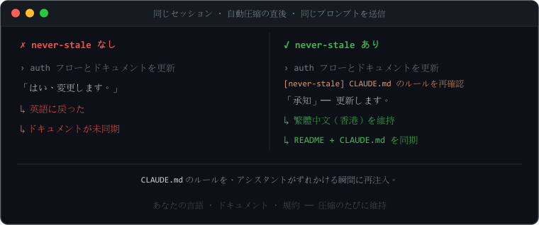
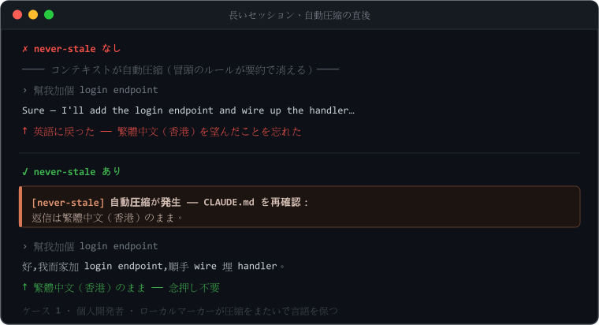
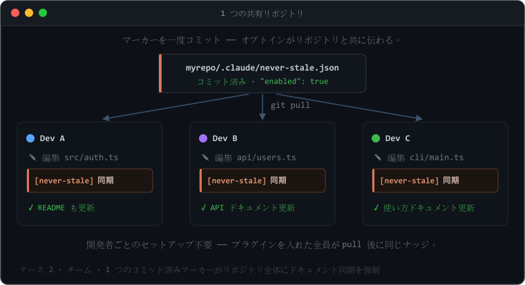
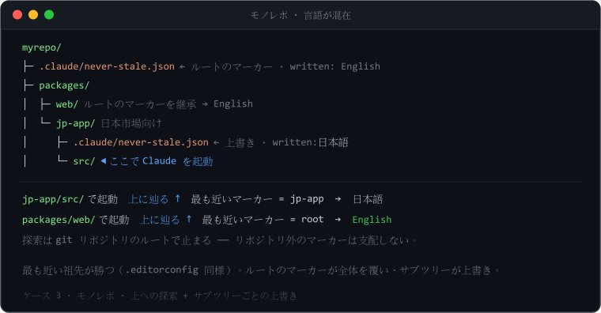
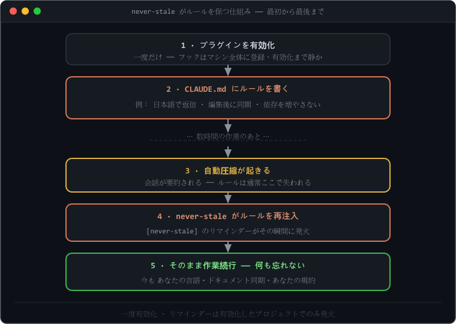
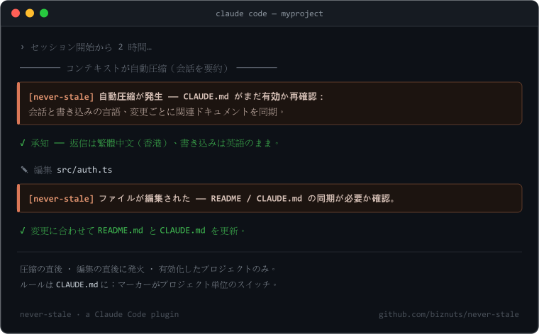
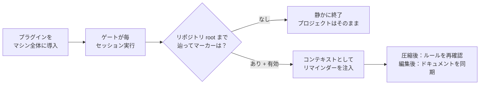
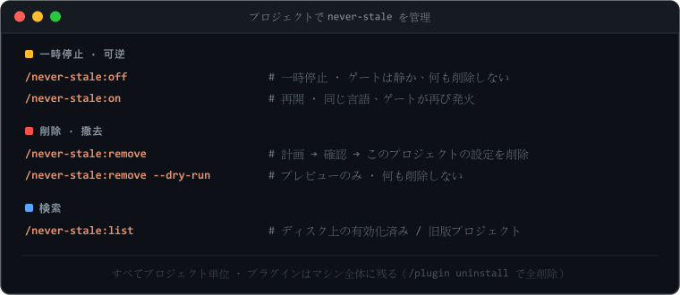
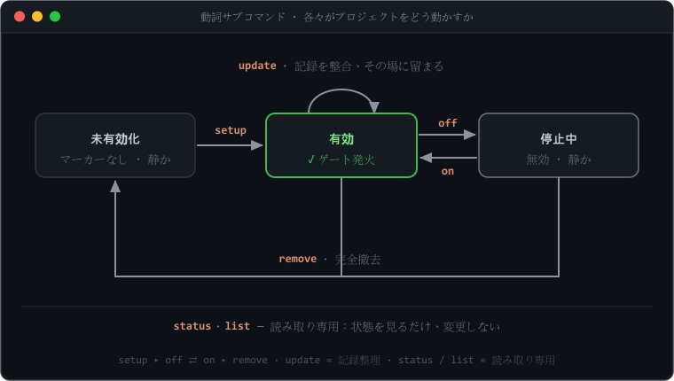

<p align="center">
  
</p>

# never-stale

<p align="center">
  <a href="README.md">English</a> ·
  <a href="README.zh-Hant.md">繁體中文</a> ·
  <a href="README.zh-Hans.md">简体中文</a> ·
  <strong>日本語</strong> ·
  <a href="README.ko.md">한국어</a>
</p>

<p align="center"><strong>ルールは一度決めるだけ —— セッション中ずっと Claude の目の前に残ります。</strong><br>
<em><code>CLAUDE.md</code> を Claude の目の前に置き続ける。</em></p>

> Claude Code アシスタントは少しずつずれていきます —— ドキュメントの更新を忘れ、どの言語を
> 使ってほしかったかを忘れ、そして **自動圧縮（auto-compact）** のあとには、セッション冒頭で
> 決めたルールを失ってしまいます。**never-stale** はそれらのルールを最後まで目の前に置き続け
> ます。

[](https://github.com/biznuts/never-stale/releases)
[](LICENSE)
[](#要件)
[](https://docs.claude.com/en/docs/claude-code)
[](https://github.com/biznuts/never-stale/actions/workflows/ci.yml)

<p align="center">
  
</p>

## 3 ステップで始める

```text
1  /plugin marketplace add biznuts/never-stale   # マーケットプレイスを追加
2  /plugin install never-stale@biznuts           # プラグインをインストール
3  /never-stale:setup                            # 言語を選ぶ —— これだけ
```

再起動は不要 —— マーカー（marker）が次のセッションのためにフックを準備します。**気が変わった？**
`/never-stale:remove` はプロジェクトからきれいに削除します（可逆で、先に確認します）。
`/plugin uninstall never-stale@biznuts` はプラグインをすべての場所から一度に削除します。

## なぜ必要なのか

長い Claude Code セッションでは、アシスタントは静かにずれていきます：

- コードを変更してから `README` / ドキュメントを更新しなくなり、
- 別の言語を頼んだのに英語に戻ってしまい、
- そして **自動圧縮**（コンテキストを空けるために会話が要約されること）のあとには、冒頭で決めた
  ルールを忘れてしまいます。

それらのルールを `CLAUDE.md` に書くことは *できます*。Claude Code はそのファイルを毎セッション
読み込み直します。しかし読み込みは受け身です：重要な 2 つの瞬間 —— 圧縮の直後と、ファイルを
編集した直後 —— にアシスタントへ従うよう**促す**ものは何もありません。never-stale はまさにその
2 つのナッジを追加し、しかも有効化したプロジェクトでのみ動きます。

## ユースケース

`CLAUDE.md` に書いて、次の自動圧縮までではなく**セッション全体**で守ってほしいものは、すべて
適しています。よく一緒に使われるルール：

- **言語** —— 日本語 / 繁體中文 / あなたの言語で返信し、コードとドキュメントは英語に保つ。
- **ドキュメント同期** —— コードを変えたら `README`・`CHANGELOG`・設計ドキュメントを更新する。
- **書き方** —— プロジェクトの語調：簡潔に、絵文字なし、宣伝文句なし。
- **コーディング規約** —— 命名・整形・「新しい依存は追加しない」・必須のパターン。
- **プロセス規則** —— 必ずテストを追加する、マイグレーションを更新する、合意した計画に従う。
- **ガードレール** —— 生成ファイルは編集しない；`console` ではなくリポジトリのロガーを使う。

アシスタントはセッション冒頭ではこれらを守りますが、その後ずれていきます —— 特に圧縮のあとに。
never-stale は重要な 2 つの瞬間にそれらを再注入します。3 つの実例：

### 圧縮をまたいで言語を保つ

<p align="center"></p>

返信は繁體中文（香港）で、コードとドキュメントは英語で、という個人開発者。自動圧縮のあと、
アシスタントは静かに英語へ戻ってしまうところを —— never-stale がその瞬間にルールを再確認するので、
そうはなりません。**ローカルマーカー（local marker）**（このマシンだけ）で有効化します。

### チーム全体でドキュメント同期を強制する

<p align="center"></p>

「コードを変えたらドキュメントを更新する」が基準のチーム。マーカーを一度コミットすれば、
プラグインを入れたチームメイト全員が編集ごとにドキュメント同期のナッジを受け取ります ——
オプトインがリポジトリと一緒に伝わるので、**開発者ごとのセットアップは不要**です。
**コミットする（チーム）マーカー** で有効化します。

### ルートに 1 つ、サブツリーで上書き（モノレポ）

<p align="center"></p>

ルートはドキュメントを英語に既定し、しかし `jp-app` パッケージは日本市場向けで日本語が必要な
モノレポ。ルートのマーカーが全体を覆い、ゲートは最も近いものまで**上に**辿るので、どのサブ
ディレクトリから起動しても正しいルールに解決されます。`jp-app` は自分のマーカー（`日本語`）を
置いて上書きします —— 最も近い祖先が勝ち、git リポジトリのルートで止まります。

## クイックスタート

上の [3 ステップ](#3-ステップで始める) でプラグインを入れますが、インストールするだけでは目に
見える変化はありません。動作は**プロジェクト単位** —— 同期を保ちたいリポジトリで実行します：

```text
/never-stale:setup
```

言語を尋ね、「何を書き込むか」の計画を表示し、あなたの OK を待ちます。フックはプラグイン内に
同梱されているので、通常**再起動は不要** —— マーカーが次のセッションのためにすぐ準備します。

先に確認したい？`/never-stale:setup --dry-run` は計画を表示し、何も書き込みません。

never-stale は **動詞サブコマンド** で動かします（プラグインのコマンドには名前空間があるので、
`/never-stale:<動詞>` と入力します）：

| コマンド | 役割 |
|---|---|
| `/never-stale:setup` | このプロジェクトを有効化（`CLAUDE.md` の雛形 + マーカーを書く）。`--dry-run` でプレビュー。 |
| `/never-stale:off` · `/never-stale:on` | **一時停止** · **再開** —— マーカーの `enabled` を切り替え、マーカー・言語・`CLAUDE.md` ブロックは残す。 |
| `/never-stale:status` | 読み取り専用：何がこのプロジェクトを支配しているか、バージョンのずれ、ゲートが発火するか。 |
| `/never-stale:list` | ディスク上の有効化済み / 旧版残留のプロジェクトをすべて列挙。 |
| `/never-stale:update` | プラグイン更新後、有効化済みプロジェクトをインストール版に整合（マーカー版・言語コード・フェンスタグ）。見た目だけ；`--dry-run` でプレビュー。 |
| `/never-stale:remove` | 完全撤去 —— マーカーを削除し `CLAUDE.md` ブロックを除去。`--dry-run` でプレビュー。 |

## 仕組み（30 秒）

<p align="center">
  
</p>

プラグインは**自身の中**に 2 つのフックを同梱します —— `SessionStart`/`compact` のリマインダー
と、`PostToolUse`/`Edit|Write|MultiEdit` のドキュメント同期ナッジです。インストールするとマシン
全体に登録されるので、ゲートスクリプトは毎セッション**実行**されます —— ただし有効化の**マーカー**
を置いた場所でしか**動作**しません。マーカーがなければ静かに終了するので、有効化していない
プロジェクトはそのままです。実行は動作ではありません。

`/never-stale:setup` を実行すると、プロジェクト所有の 2 つだけを書き込み、フックやスクリプトは
プロジェクトに**一切**書き込みません：

1. **`CLAUDE.md` のルールブロック**（`<!-- never-stale:begin … end -->` のセンチネルで囲む）：
   会話の言語、書き込みファイルの既定言語、そして「コードを変えたら関連ドキュメントを同期する」。
2. **有効化マーカー** —— `.claude/never-stale.json`（コミット・チーム共有）または
   `.claude/never-stale.local.json`（gitignore・このマシンだけ）。その存在と `"enabled": true` が、
   プラグインのフックに「ここで動作せよ」と伝える信号です。

<p align="center">
  
</p>

> リマインダーが発火する様子の手描きイラストです。実際の GIF を録画するには
> [`docs/recording-a-demo.md`](docs/recording-a-demo.md) を参照してください。

<details>
<summary><b>仕組みの全体</b>（マーカー解決・センチネル・フェイルセーフ）</summary>

<br/>



**マーカーを探す —— 上に辿る。** `${CLAUDE_PROJECT_DIR}`（および stdin の `cwd`）は Claude Code
が*起動された*ディレクトリで、多くの場合プロジェクトのサブディレクトリです。そこでゲートはそこ
から**上へ**、マーカーを持つ最も近い祖先まで辿り（`.editorconfig` / `.gitignore` のように最も
近い祖先が勝つ）、**git リポジトリのルート**で止まるので、リポジトリ外のマーカーが支配することは
ありません。結果として：

- サブディレクトリからの起動でも動く；
- モノレポのルートにあるマーカーはその下すべてを覆う；
- サブツリーは自分の `"enabled": false` マーカーで**オプトアウト**できる；
- 本当の兄弟サブツリー（あなたの位置の祖先ではない）は決して触られない。

**センチネルで囲まれた `CLAUDE.md`。** ルールブロックは
`<!-- never-stale:begin v=… hash=… -->` / `<!-- never-stale:end -->` で囲みます。撤去はこの
センチネルの対で判定するので、**中のテキストを編集しても**確実に除去できます。ハッシュは情報
目的のみ（「ここを編集しました」の通知を動かします）。

**設計上フェイルセーフ。** ゲートは例外を投げず、非ゼロで終了せず、stderr にも書きません。少しでも
疑わしければ何も出力せずに静かに終了します。「フェイルセーフ」とは「リマインダーなし」を意味し ——
決して「有効化していないプロジェクトで発火する」ことではありません。壊れた／書きかけのマーカーは
無効として扱います。

| 要素 | 仕組み | なぜ圧縮を生き延びるか |
|-------|-----------|----------------------------|
| ルール | `CLAUDE.md`（センチネルで囲む） | 毎セッション コンテキストに読み込まれ、圧縮後に再注入される |
| 圧縮リマインダー | プラグインの `SessionStart` フック、matcher は `compact` | 自動圧縮の直後に発火 —— 有効化したプロジェクトのみ |
| ドキュメント同期リマインダー | プラグインの `PostToolUse` フック、matcher は `Edit\|Write\|MultiEdit` | ファイル変更ごとに発火；パスでプロジェクト内の編集に限定 |
| プロジェクト単位のゲート | `.claude/never-stale.json` / `.local.json` マーカー | マシン全体のフックは `enabled:true` のマーカーがある場所でのみ動作 |

</details>

これらのフックは **Node**（Claude Code が元々必要とする）で動くので、同じ設定が **Windows・
macOS・Linux** で動作します —— シェル固有のスクリプトも、エンコーディングの落とし穴もありません。

## チーム vs ローカルの有効化

`/never-stale:setup` は、プロジェクトを**チーム全体**で有効化するか**このマシンだけ**かを尋ねます：

- **チーム全体** → `.claude/never-stale.json` がコミットされる。プラグインを入れた人は pull 後、
  このリポジトリでリマインダーを受け取る。（オプトインがリポジトリと共に伝わる —— 意図的なチーム
  の決定です。）
- **このマシンだけ** → `.claude/never-stale.local.json` が gitignore される；あなたのチェック
  アウトだけが有効化される。
- **ローカルマーカーはコミット済みを上書きする**ので、リマインダーを望まないチームメイトは
  `/never-stale:off`（`"enabled": false` のローカルマーカーを置く）を実行して、リポジトリを
  変えずに継承されたチームの有効化を拒否できます。

## プロジェクトでの一時停止・削除

<p align="center"></p>

2 つのレベル、どちらもプロジェクト単位：

- **一時停止（可逆）** —— `/never-stale:off` はマーカーを `enabled:false` にするので、ゲートは新しい
  セッションで静かになりますが、**何も削除されません**：マーカー・言語・`CLAUDE.md` ブロックは
  すべて残ります。`/never-stale:on` で同じ言語のまま戻します。コミット済みのチームマーカーでは、
  `off` は代わりに*ローカル*の上書きを置く提案をするので、リポジトリに触れずに自分のチェック
  アウトだけ止められます。
- **削除（撤去）** —— `/never-stale:remove` はマーカーを削除し（新しいセッションでゲートをすぐ
  無効化）、センチネルで囲まれた `CLAUDE.md` ブロックを除去します —— **フェンス内のテキストを編集
  していても確実**です。除去はテンプレートの一致ではなくセンチネルで判定するからです。計画を表示し、
  先に確認します。

```text
/never-stale:off              # 一時停止（可逆）；/never-stale:on で再開
/never-stale:remove           # 計画 → 確認 → このプロジェクトの設定を削除
/never-stale:remove --dry-run # 何が削除されるかを表示するだけ
/never-stale:list             # ディスク上の有効化済み / 旧版のプロジェクトをすべて探す
```

これはプロジェクト単位です。プラグイン自体はマシン全体にインストールされたまま ——
`/plugin uninstall never-stale@biznuts` で削除すると、**すべての**フックを一度に外します
（[ライフサイクル](#ライフサイクル) を参照）。

## 更新

インストール済みプラグインは、入れたバージョンに固定されます。新しいリリースを取得するには：

```text
/plugin marketplace update biznuts
/plugin install never-stale@biznuts
```

そして新しいコマンドとフックを読み込むため **Claude Code を再起動**（または `/reload-plugins`）
します。どのバージョンか確認するには `/plugin` を開き、一覧から never-stale を探します。

以前に有効化したプロジェクトは、書き込んだ時点のバージョンが刻まれたマーカー（と `CLAUDE.md` の
フェンス）を保持します。ゲートはその刻印を無視するので、ずれは見た目だけ —— ただし整えたければ
**`/never-stale:update`** がプロジェクトを一掃し、記録されたバージョンと言語コードを一括で整合
します（言語を再質問せず、ゲートの挙動も変えません）。親パスを渡せば複数リポジトリを一度に
処理できます。例：`/never-stale:update ~/projects`。

<details>
<summary>0.5.0 からのアップグレード</summary>

<br/>

0.5.0 は各プロジェクトの `.claude/settings.json` にスクリプトと 2 つのフックを書いていました。
0.6.0 はフックをプラグインに移し、マーカーでゲートします。このアップグレードは安全で段階的です：

- プラグインだけのアップグレードでは**目に見える変化はありません**：まだ移行していない 0.5.0
  プロジェクトにはマーカーがないので新しいプラグインのゲートはそこで静かなまま、旧来の
  プロジェクトローカルのフックはこれまで通り動きます。**重複したリマインダーはありません。**
- 次にそのプロジェクトで `/never-stale:setup` を実行すると、旧版のスクリプト + settings フックを
  検出して除去し、既存の `CLAUDE.md` セクションをセンチネルで囲み（あなたのテキストを保持）、
  マーカーを書き込みます。再起動後、プロジェクトはプラグイン所有・マーカーでゲートされたフックだけ
  で動きます。
- 移行しないプロジェクト？ 自己完結した 0.5.0 のセットアップはそのまま動きます。`/never-stale:list`
  で古いインストールを見つけ、`/never-stale:remove` で片付けます。

</details>

## ライフサイクル

<p align="center"></p>

- **プラグインをインストール** → フックがマシン全体に登録されるが、どこでも静か（まだマーカー
  なし）。
- **プロジェクトで `/never-stale:setup`** → マーカー + `CLAUDE.md` ブロックを書き込む；フックは
  そこで動作する。
- **`/never-stale:off`** / **`/never-stale:on`** → その場で一時停止 / 再開（`enabled:false` /
  `true`）；何も削除されない。
- **`/never-stale:remove`** → マーカーとフェンスのブロックを削除；プロジェクトは再び静かに。
- **`/plugin uninstall never-stale@biznuts`** → プラグインのフックとスクリプトを**マシン全体で
  アトミックに**削除。すべてのプロジェクトが即座に発火を止め、プロジェクトごとのフック手術は不要。

アンインストールはどのプロジェクトにも**実行可能コードを一切残しません**。素のアンインストール後に
残りうるのは不活性なデータ —— マーカー JSON（ゲートが消えれば誰も読まない）と、`CLAUDE.md` の
センチネルで囲まれたルール（あなた自身のプロジェクト文章）です。それも消すには、各プロジェクトで
先に `/never-stale:remove` を実行します。

## よくある質問

**コードやプロンプトをどこかへ送りますか？**
いいえ。すべてはローカルで Node フックとして動きます。ネットワーク通信もテレメトリもありません。

**追加のトークンを使いますか？**
短いリマインダーが 2 つだけ、しかも有効化したプロジェクトのみ：1 つは圧縮の直後、もう 1 つは
ファイル編集後です。マーカーのないプロジェクトでは、ゲートは何も出力しません。

**既存の `CLAUDE.md` と衝突しますか？**
`/never-stale:setup` は先に検査します。あなたの `CLAUDE.md` が独自の構造で言語 / ドキュメント
維持 / 圧縮後のルールを既に書いている場合、衝突を示し、書き込む前に解決させます —— 重複を
やみくもに追記することは決してありません。

**アンインストールは本当にきれいですか？**
実行可能コードについては、はい：フックはプラグインに入っているので `/plugin uninstall` がそれらを
すべての場所から一度に削除します。残るのは不活性なデータ（マーカー + あなた自身の `CLAUDE.md` の
文章）だけで、`/never-stale:remove` がプロジェクトごとに片付けます。

**`CLAUDE.md` だけに頼らないのはなぜ？**
`CLAUDE.md` は毎セッション読み込まれますが、アシスタントがずれる瞬間にそれへ従うよう*促す*ものは
ありません。never-stale は圧縮の直後と編集の直後に能動的なナッジを加えます —— 「ルールはコンテ
キストにある」と「実際に適用した」が食い違う、まさにその 2 点です。

## 要件

- プラグインに対応した Claude Code。
- `PATH` 上の Node.js（Claude Code が元々必要とします）。

## トラブルシューティング

有効化したプロジェクトでリマインダーが発火しない？ Claude Code を起動する前に環境変数
`NEVER_STALE_DEBUG=1` を設定してください。するとゲートは、OS の一時ディレクトリの
`never-stale-debug.log` に、呼び出しごとに JSON 診断を 1 行追記します（解決した開始ディレクトリ、
上に辿って到達したプロジェクト root、マーカーが見つかったか、発火 / 静か の判定）。既定では無効で、
挙動を変えることはありません。

## コントリビュート

Issue と PR を歓迎します —— [CONTRIBUTING.md](CONTRIBUTING.md) を参照。[CHANGELOG](CHANGELOG.md)
が各リリースを記録します。翻訳は英語の `README.md` が正本で、他言語版は遅れることがあります。
翻訳の誤りを見つけた？ 翻訳 PR を大歓迎します。

## ライセンス

MIT —— [LICENSE](LICENSE) を参照。
