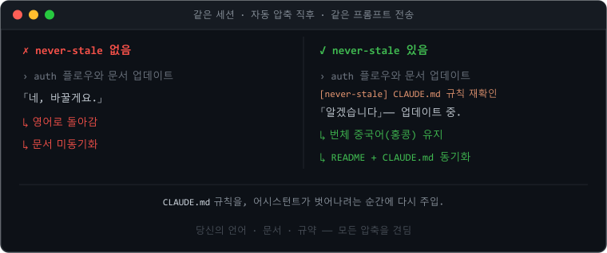
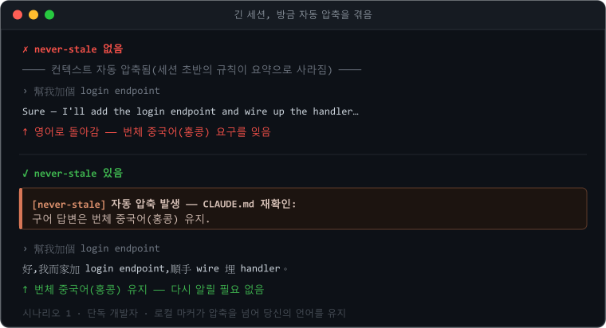
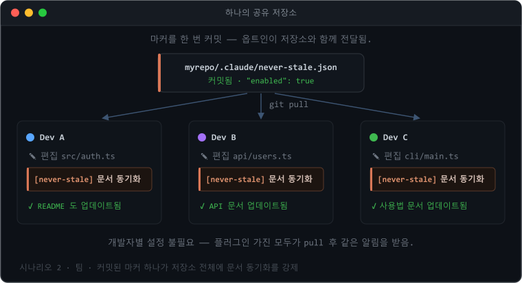
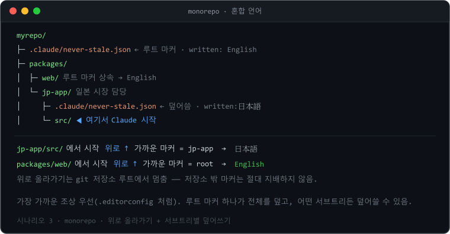
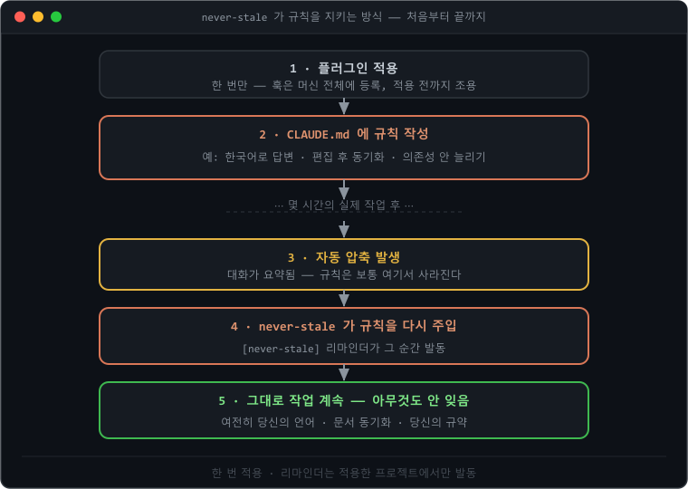
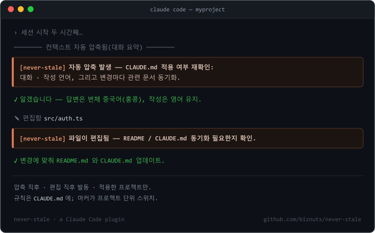
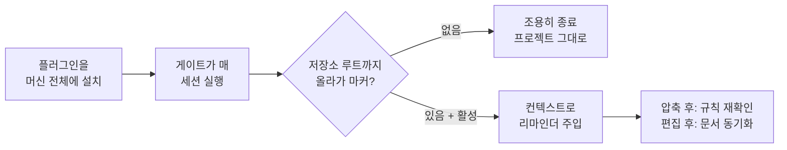
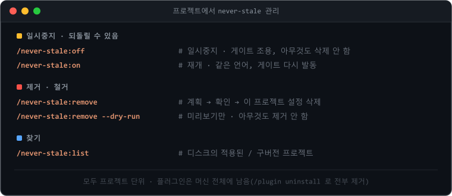
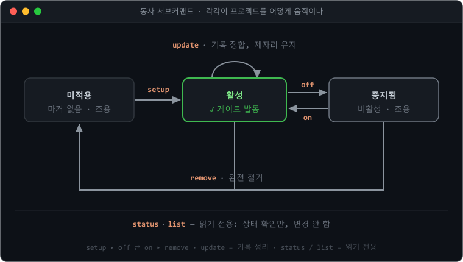

<p align="center">
  
</p>

# never-stale

<p align="center">
  <a href="README.md">English</a> ·
  <a href="README.zh-Hant.md">繁體中文</a> ·
  <a href="README.zh-Hans.md">简体中文</a> ·
  <a href="README.ja.md">日本語</a> ·
  <strong>한국어</strong>
</p>

<p align="center"><strong>규칙은 한 번만 정하세요 —— 세션 내내 Claude 앞에 남아 있습니다.</strong><br>
<em><code>CLAUDE.md</code> 를 Claude 앞에 계속 두세요.</em></p>

> Claude Code 어시스턴트는 조금씩 벗어납니다 —— 문서 업데이트를 잊고, 어떤 언어를 원했는지
> 잊고, 그리고 **자동 압축(auto-compact)** 후에는 세션 처음에 정한 규칙을 잃어버립니다.
> **never-stale** 은 그 규칙들을 끝까지 어시스턴트 앞에 둡니다.

[](https://github.com/biznuts/never-stale/releases)
[](LICENSE)
[](#요구-사항)
[](https://docs.claude.com/en/docs/claude-code)
[](https://github.com/biznuts/never-stale/actions/workflows/ci.yml)

<p align="center">
  
</p>

## 3단계로 시작하기

```text
1  /plugin marketplace add biznuts/never-stale   # 마켓플레이스 추가
2  /plugin install never-stale@biznuts           # 플러그인 설치
3  /never-stale:setup                            # 언어 선택 —— 이게 전부
```

재시작 필요 없음 —— 마커(marker)가 다음 세션을 위해 훅을 준비합니다. **마음이 바뀌었나요?**
`/never-stale:remove` 는 프로젝트에서 깔끔하게 제거합니다(되돌릴 수 있고, 먼저 묻습니다).
`/plugin uninstall never-stale@biznuts` 는 플러그인을 모든 곳에서 한 번에 제거합니다.

## 왜 필요한가

긴 Claude Code 세션에서 어시스턴트는 조용히 벗어납니다:

- 코드를 바꾼 뒤 `README` / 문서를 더 이상 업데이트하지 않고,
- 다른 언어를 부탁했는데 영어로 돌아가고,
- 그리고 **자동 압축**(컨텍스트를 비우려 대화가 요약되는 것) 후에는 맨 처음 정한 규칙을
  잊어버립니다.

그 규칙들을 `CLAUDE.md` 에 적을 *수는* 있고, Claude Code 는 매 세션 그 파일을 다시 읽습니다.
하지만 다시 읽는 것은 수동적입니다: 가장 중요한 두 순간 —— 압축 직후, 그리고 파일을 편집한
직후 —— 에 어시스턴트가 그것을 따르도록 **상기시키는** 것은 아무것도 없습니다. never-stale 은
바로 그 두 가지 넛지를 더하며, 적용한 프로젝트에서만 동작합니다.

## 사용 사례

`CLAUDE.md` 에 적어 두고 다음 자동 압축까지가 아니라 **세션 전체** 동안 지켜지길 원하는 것은
무엇이든 어울립니다. 흔히 함께 쓰는 규칙:

- **언어** —— 한국어 / 日本語 / 당신의 언어로 답변하고, 코드와 문서는 영어로 유지.
- **문서 동기화** —— 코드를 바꾸면 `README`, `CHANGELOG`, 설계 문서를 업데이트.
- **글쓰기 스타일** —— 프로젝트의 어조: 간결하게, 이모지 없이, 마케팅 표현 없이.
- **코딩 규약** —— 네이밍, 포매팅, "새 의존성 추가 금지", 반드시 쓰는 패턴.
- **프로세스 규칙** —— 항상 테스트 추가, 마이그레이션 업데이트, 합의한 계획 따르기.
- **가드레일** —— 생성된 파일은 편집하지 않기; `console` 대신 저장소의 로거 사용.

어시스턴트는 세션 처음에는 이것들을 지키다가 벗어납니다 —— 특히 압축 후에. never-stale 은
가장 중요한 두 순간에 그것들을 다시 주입합니다. 세 가지 실제 예:

### 압축을 넘어 언어를 유지

<p align="center"></p>

답변은 번체 중국어(홍콩)로, 코드와 문서는 영어로 두고 싶은 1인 개발자. 자동 압축 후 어시스턴트는
조용히 영어로 돌아가려 하지만 —— never-stale 가 그 순간에 규칙을 다시 확인하므로 그렇게 되지
않습니다. **로컬 마커(local marker)**(이 머신만)로 적용합니다.

### 팀 전체에 문서 동기화 강제

<p align="center"></p>

"코드를 바꾸면 문서를 업데이트한다"가 기준인 팀. 마커를 한 번 커밋하면 플러그인을 설치한 모든
동료가 편집할 때마다 문서 동기화 넛지를 받습니다 —— 적용 설정이 저장소와 함께 따라가므로
**개발자별 설정이 필요 없습니다**. **커밋하는 (팀) 마커** 로 적용합니다.

### 루트 마커 하나, 서브트리별 재정의 (모노레포)

<p align="center"></p>

루트는 문서를 영어로 기본값을 두지만 `jp-app` 패키지는 일본 시장을 담당해 일본어가 필요한
모노레포. 루트의 마커가 전체를 덮고, 게이트는 가장 가까운 것까지 **위로** 올라가므로 어떤
하위 디렉터리에서 시작해도 올바른 규칙으로 해석됩니다. `jp-app` 은 자신의 마커(`日本語`)를
두어 재정의합니다 —— 가장 가까운 조상이 이기고, git 저장소 루트에서 멈춥니다.

## 빠른 시작

위의 [3단계](#3단계로-시작하기) 로 플러그인을 설치하지만, 설치만으로는 눈에 보이는 변화가
없습니다. 동작은 **프로젝트 단위** —— 동기화를 유지하고 싶은 저장소에서 실행합니다:

```text
/never-stale:setup
```

언어를 묻고, "무엇을 쓸지"의 계획을 보여 주고, 당신의 OK 를 기다립니다. 훅은 플러그인 안에 함께
들어 있으므로 보통 **재시작이 필요 없습니다** —— 마커가 다음 세션을 위해 즉시 준비합니다.

먼저 확인하고 싶나요? `/never-stale:setup --dry-run` 은 계획을 보여 주고 아무것도 쓰지 않습니다.

never-stale 은 **동사 서브커맨드** 로 움직입니다(플러그인 명령에는 네임스페이스가 있어
`/never-stale:<동사>` 로 입력합니다):

| 명령 | 역할 |
|---|---|
| `/never-stale:setup` | 이 프로젝트를 적용(`CLAUDE.md` 스캐폴드 + 마커 작성). `--dry-run` 미리보기. |
| `/never-stale:off` · `/never-stale:on` | **일시중지** · **재개** —— 마커의 `enabled` 를 전환하고 마커·언어·`CLAUDE.md` 블록은 유지. |
| `/never-stale:status` | 읽기 전용: 무엇이 이 프로젝트를 지배하는지, 버전 드리프트, 게이트 발동 여부. |
| `/never-stale:list` | 디스크의 적용된 / 구버전 잔여 프로젝트를 모두 나열. |
| `/never-stale:update` | 플러그인 업그레이드 후, 적용된 프로젝트를 설치 버전에 맞춤(마커 버전·언어 코드·펜스 태그). 외형만; `--dry-run` 미리보기. |
| `/never-stale:remove` | 완전 제거 —— 마커를 삭제하고 `CLAUDE.md` 블록을 제거. `--dry-run` 미리보기. |

## 작동 원리 (30초)

<p align="center">
  
</p>

플러그인은 **자기 안에** 훅 두 개를 함께 넣습니다 —— `SessionStart`/`compact` 리마인더와,
`PostToolUse`/`Edit|Write|MultiEdit` 문서 동기화 넛지입니다. 설치하면 머신 전체에 등록되므로
게이트 스크립트는 매 세션 **실행**됩니다 —— 다만 적용 **마커** 를 둔 곳에서만 **동작**합니다.
마커가 없으면 조용히 종료하므로 적용하지 않은 프로젝트는 그대로입니다. 실행은 동작이 아닙니다.

`/never-stale:setup` 을 실행하면 프로젝트 소유의 두 가지만 쓰고, 훅이나 스크립트는 프로젝트에
**전혀** 쓰지 않습니다:

1. **`CLAUDE.md` 규칙 블록**(`<!-- never-stale:begin … end -->` 센티넬로 감쌈): 대화 언어,
   작성 파일의 기본 언어, 그리고 "코드를 바꾸면 관련 문서를 동기화한다".
2. **적용 마커** —— `.claude/never-stale.json`(커밋·팀 공유) 또는
   `.claude/never-stale.local.json`(gitignore·이 머신만). 그 존재와 `"enabled": true` 가
   플러그인의 훅에 "여기서 동작하라"고 알리는 신호입니다.

<p align="center">
  
</p>

> 리마인더가 발동하는 모습을 손으로 그린 그림입니다. 실제 GIF 를 녹화하려면
> [`docs/recording-a-demo.md`](docs/recording-a-demo.md) 를 참고하세요.

<details>
<summary><b>전체 메커니즘</b>(마커 해석, 센티넬, 페일세이프)</summary>

<br/>



**마커 찾기 —— 위로 올라가기.** `${CLAUDE_PROJECT_DIR}`(그리고 stdin 의 `cwd`)는 Claude Code 가
*시작된* 디렉터리이며, 보통 프로젝트의 하위 디렉터리입니다. 그래서 게이트는 거기서 **위로**
마커를 가진 가장 가까운 조상까지 올라가고(가장 가까운 조상이 이김, `.editorconfig` /
`.gitignore` 처럼), **git 저장소 루트**에서 멈추므로 저장소 밖의 마커는 절대 지배하지 못합니다.
결과:

- 하위 디렉터리에서 시작해도 동작하고;
- 모노레포 루트의 마커는 그 아래 전체를 덮고;
- 서브트리는 자신의 `"enabled": false` 마커로 **빠질** 수 있고;
- 진짜 형제 서브트리(당신 위치의 조상이 아닌)는 절대 건드리지 않습니다.

**센티넬로 감싼 `CLAUDE.md`.** 규칙 블록은
`<!-- never-stale:begin v=… hash=… -->` / `<!-- never-stale:end -->` 로 감쌉니다. 제거는 이
센티넬 쌍으로 판단하므로 **안의 텍스트를 편집해도** 안정적으로 제거됩니다. 해시는 정보용일
뿐입니다("여기를 편집했음" 알림을 띄웁니다).

**설계상 페일세이프.** 게이트는 예외를 던지지 않고, 0이 아닌 값으로 종료하지 않고, stderr 에도
쓰지 않습니다. 조금이라도 의심스러우면 아무것도 출력하지 않고 조용히 종료합니다. "페일세이프"는
"리마인더 없음"을 뜻하며 —— 결코 "적용하지 않은 프로젝트에서 발동"이 아닙니다. 손상되었거나
쓰다 만 마커는 비활성으로 취급합니다.

| 요소 | 메커니즘 | 왜 압축을 견디나 |
|-------|-----------|----------------------------|
| 규칙 | `CLAUDE.md`(센티넬로 감쌈) | 매 세션 컨텍스트에 로드, 압축 후 다시 주입 |
| 압축 리마인더 | 플러그인 `SessionStart` 훅, matcher 는 `compact` | 자동 압축 직후 발동 —— 적용한 프로젝트만 |
| 문서 동기화 리마인더 | 플러그인 `PostToolUse` 훅, matcher 는 `Edit\|Write\|MultiEdit` | 파일 변경마다 발동; 경로로 프로젝트 내 편집에 한정 |
| 프로젝트 단위 게이트 | `.claude/never-stale.json` / `.local.json` 마커 | 머신 전체 훅은 `enabled:true` 마커가 있는 곳에서만 동작 |

</details>

이 훅들은 **Node**(Claude Code 가 이미 필요로 함)로 실행되므로 같은 설정이 **Windows·macOS·
Linux** 에서 동작합니다 —— 셸 전용 스크립트도, 인코딩 함정도 없습니다.

## 팀 vs 로컬 적용

`/never-stale:setup` 은 프로젝트를 **팀 전체**로 적용할지 **이 머신만** 적용할지 묻습니다:

- **팀 전체** → `.claude/never-stale.json` 이 커밋됩니다. 플러그인을 설치한 사람은 pull 후 이
  저장소에서 리마인더를 받습니다. (적용 설정이 저장소와 함께 이동 —— 의도된 팀의 결정입니다.)
- **이 머신만** → `.claude/never-stale.local.json` 이 gitignore 됩니다; 당신의 체크아웃만
  적용됩니다.
- **로컬 마커가 커밋된 것을 재정의**하므로, 리마인더를 원하지 않는 동료는 `/never-stale:off`
  (`"enabled": false` 로컬 마커를 둠)를 실행해 저장소를 바꾸지 않고 상속된 팀 적용을 거부할 수
  있습니다.

## 프로젝트에서 일시중지·제거

<p align="center"></p>

두 단계, 모두 프로젝트 단위:

- **일시중지(되돌릴 수 있음)** —— `/never-stale:off` 는 마커를 `enabled:false` 로 바꿔 게이트가
  새 세션에서 조용해지지만, **아무것도 삭제하지 않습니다**: 마커·언어·`CLAUDE.md` 블록 모두
  남습니다. `/never-stale:on` 으로 같은 언어로 다시 켭니다. 커밋된 팀 마커에서는 `off` 가 대신
  *로컬* 재정의를 두자고 제안하므로, 저장소를 건드리지 않고 자신의 체크아웃만 멈출 수 있습니다.
- **제거(철거)** —— `/never-stale:remove` 는 마커를 삭제하고(새 세션에서 게이트를 즉시 해제)
  센티넬로 감싼 `CLAUDE.md` 블록을 제거합니다 —— **펜스 안의 텍스트를 편집했어도 안정적**입니다.
  제거가 템플릿 일치가 아니라 센티넬로 판단하기 때문입니다. 계획을 보여 주고 먼저 묻습니다.

```text
/never-stale:off              # 일시중지(되돌릴 수 있음); /never-stale:on 재개
/never-stale:remove           # 계획 → 확인 → 이 프로젝트의 설정 삭제
/never-stale:remove --dry-run # 무엇이 제거될지 보여 주기만
/never-stale:list             # 디스크의 적용된 / 구버전 프로젝트를 모두 찾기
```

이것은 프로젝트 단위입니다. 플러그인 자체는 머신 전체에 설치된 채 남습니다 ——
`/plugin uninstall never-stale@biznuts` 로 제거하면 **모든** 훅을 한 번에 해제합니다
([라이프사이클](#라이프사이클) 참고).

## 업데이트

설치된 플러그인은 설치한 버전에 고정됩니다. 더 새 릴리스를 받으려면:

```text
/plugin marketplace update biznuts
/plugin install never-stale@biznuts
```

그런 다음 새 명령과 훅을 로드하도록 **Claude Code 를 재시작**(또는 `/reload-plugins`)합니다. 어떤
버전인지 보려면 `/plugin` 을 열어 목록에서 never-stale 를 찾습니다.

이전에 적용한 프로젝트는 작성된 시점의 버전이 찍힌 마커(와 `CLAUDE.md` 펜스)를 유지합니다.
게이트는 그 각인을 무시하므로 드리프트는 순전히 외형일 뿐 —— 하지만 깔끔하게 하고 싶다면
**`/never-stale:update`** 가 프로젝트들을 훑어 기록된 버전과 언어 코드를 한 번에 맞춥니다(언어를
다시 묻지 않고, 게이트 동작도 바꾸지 않습니다). 상위 경로를 넘기면 여러 저장소를 한 번에 처리할
수 있습니다. 예: `/never-stale:update ~/projects`.

<details>
<summary>0.5.0 에서 업그레이드</summary>

<br/>

0.5.0 은 각 프로젝트의 `.claude/settings.json` 에 스크립트와 훅 두 개를 썼습니다. 0.6.0 은 훅을
플러그인으로 옮기고 마커로 게이트합니다. 이 업그레이드는 안전하고 점진적입니다:

- 플러그인만 업그레이드해도 **눈에 보이는 변화는 없습니다**: 아직 마이그레이션하지 않은 0.5.0
  프로젝트에는 마커가 없으므로 새 플러그인 게이트는 거기서 조용하고, 기존 프로젝트 로컬 훅은
  이전처럼 동작합니다. **중복 리마인더 없음.**
- 다음에 그런 프로젝트에서 `/never-stale:setup` 을 실행하면 구버전 스크립트 + settings 훅을
  감지해 제거하고, 기존 `CLAUDE.md` 섹션을 센티넬로 감싸고(당신의 텍스트 유지), 마커를 씁니다.
  재시작 후 프로젝트는 순전히 플러그인 소유·마커로 게이트되는 훅으로 동작합니다.
- 어떤 프로젝트를 끝내 마이그레이션 안 하나요? 자기완결적인 0.5.0 설정은 그대로 동작합니다.
  `/never-stale:list` 로 옛 설치를 찾고 `/never-stale:remove` 로 정리합니다.

</details>

## 라이프사이클

<p align="center"></p>

- **플러그인 설치** → 훅이 머신 전체에 등록되지만 어디서나 조용함(아직 마커 없음).
- **프로젝트에서 `/never-stale:setup`** → 마커 + `CLAUDE.md` 블록 작성; 훅이 거기서 동작.
- **`/never-stale:off`** / **`/never-stale:on`** → 제자리에서 일시중지 / 재개(`enabled:false` /
  `true`); 아무것도 삭제 안 함.
- **`/never-stale:remove`** → 마커와 펜스 블록 삭제; 프로젝트가 다시 조용해짐.
- **`/plugin uninstall never-stale@biznuts`** → 플러그인의 훅과 스크립트를 **머신 전체에서
  원자적으로** 제거. 모든 프로젝트가 즉시 발동을 멈추며, 프로젝트별 훅 수술이 필요 없음.

언인스톨은 어떤 프로젝트에도 **실행 코드를 전혀 남기지 않습니다**. 맨 언인스톨 후 남을 수 있는
것은 비활성 데이터 —— 마커 JSON(게이트가 사라지면 아무도 읽지 않음)과 `CLAUDE.md` 의 센티넬로
감싼 규칙(당신 자신의 프로젝트 글)입니다. 그것까지 지우려면 각 프로젝트에서 먼저
`/never-stale:remove` 를 실행하세요.

## 자주 묻는 질문

**내 코드나 프롬프트를 어딘가로 보내나요?**
아니요. 모든 것은 로컬에서 Node 훅으로 실행됩니다. 네트워크 호출도 텔레메트리도 없습니다.

**토큰을 추가로 쓰나요?**
짧은 리마인더 두 개뿐이며, 적용한 프로젝트에서만: 하나는 압축 직후, 하나는 파일 편집 후입니다.
마커가 없는 프로젝트에서는 게이트가 아무것도 출력하지 않습니다.

**기존 `CLAUDE.md` 와 충돌하나요?**
`/never-stale:setup` 은 먼저 검사합니다. 당신의 `CLAUDE.md` 가 이미 자체 구조로 언어 / 문서 유지
/ 압축 후 규칙을 적고 있으면, 충돌을 표시하고 쓰기 전에 해결하게 합니다 —— 절대 중복을 무턱대고
덧붙이지 않습니다.

**언인스톨이 정말 깔끔한가요?**
실행 코드에 대해서는 예: 훅이 플러그인 안에 있으므로 `/plugin uninstall` 이 그것들을 모든 곳에서
한 번에 제거합니다. 남는 것은 비활성 데이터(마커 + 당신 자신의 `CLAUDE.md` 글)뿐이며,
`/never-stale:remove` 가 프로젝트별로 정리합니다.

**왜 그냥 `CLAUDE.md` 에 의존하지 않나요?**
`CLAUDE.md` 는 매 세션 다시 로드되지만, 어시스턴트가 벗어나는 순간에 그것을 따르도록 *재촉하는*
것은 없습니다. never-stale 는 압축 직후와 편집 직후에 능동적인 넛지를 더합니다 —— "규칙이
컨텍스트에 있다"와 "실제로 적용했다"가 갈라지는 바로 그 두 지점입니다.

## 요구 사항

- 플러그인을 지원하는 Claude Code.
- `PATH` 상의 Node.js(Claude Code 가 이미 필요로 함).

## 문제 해결

적용한 프로젝트에서 리마인더가 발동하지 않나요? Claude Code 를 시작하기 전에 환경 변수
`NEVER_STALE_DEBUG=1` 을 설정하세요. 그러면 게이트는 OS 임시 디렉터리의 `never-stale-debug.log`
에 호출마다 JSON 진단을 한 줄 덧붙입니다(해석된 시작 디렉터리, 위로 올라가 도달한 프로젝트 루트,
마커를 찾았는지, 발동 / 조용 판정). 기본값은 꺼짐이며 동작을 바꾸지 않습니다.

## 기여

이슈와 PR 을 환영합니다 —— [CONTRIBUTING.md](CONTRIBUTING.md) 참고. [CHANGELOG](CHANGELOG.md) 가
각 릴리스를 기록합니다. 번역은 영어 `README.md` 가 정본이며, 다른 언어판은 뒤처질 수 있습니다.
부정확한 번역을 발견했나요? 번역 PR 을 환영합니다.

## 라이선스

MIT —— [LICENSE](LICENSE) 참고.
