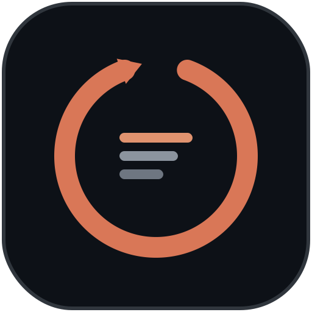
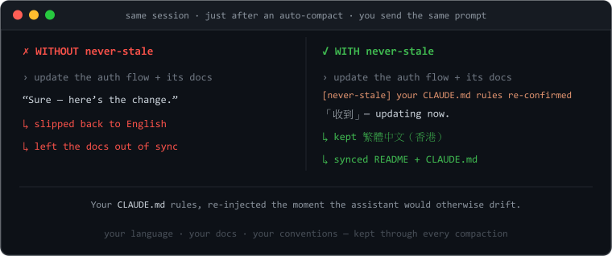
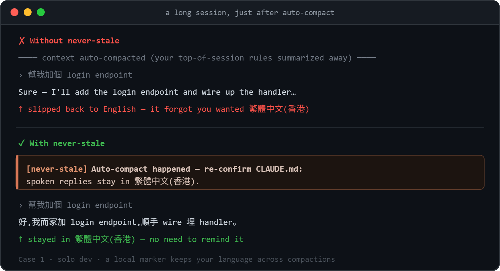
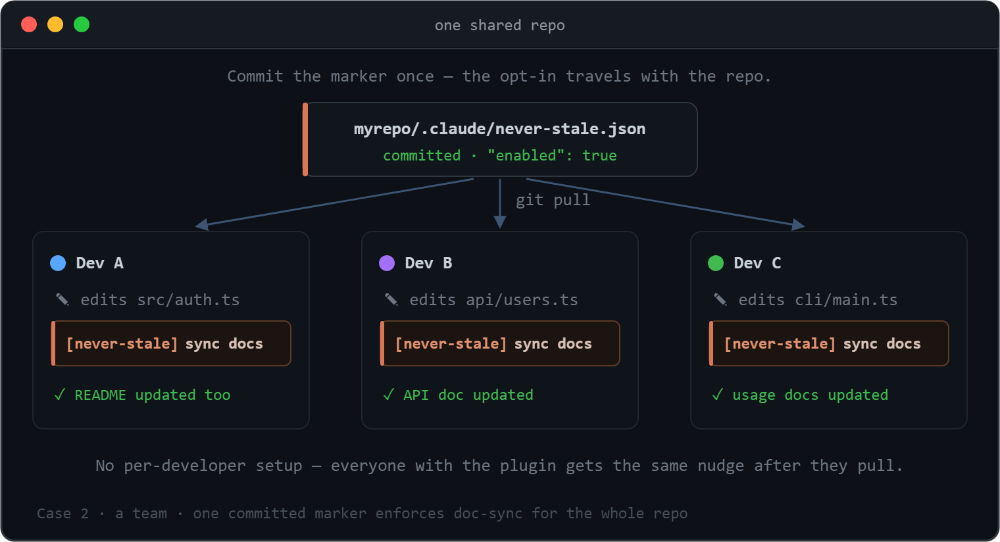
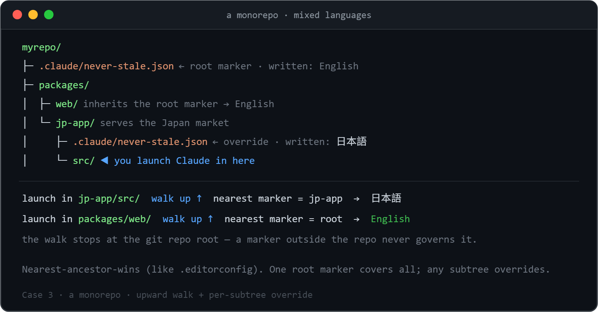
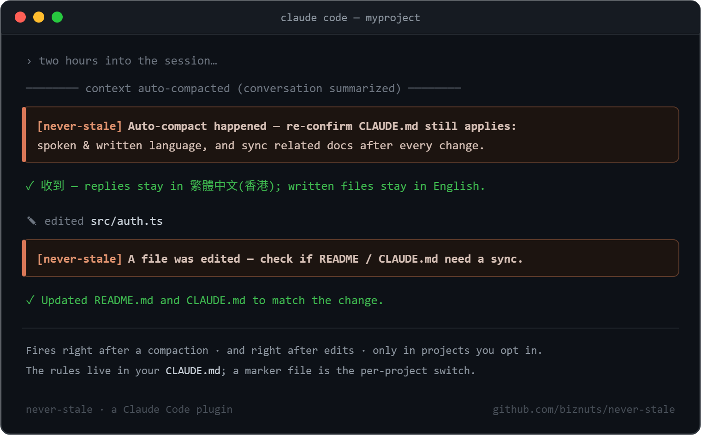
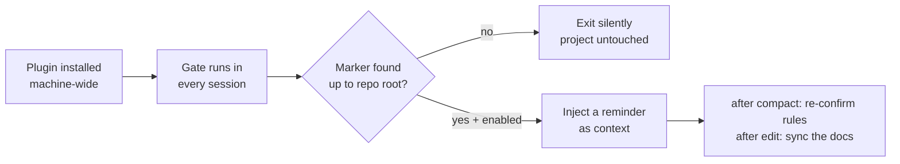
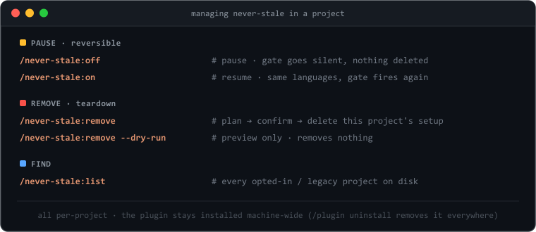
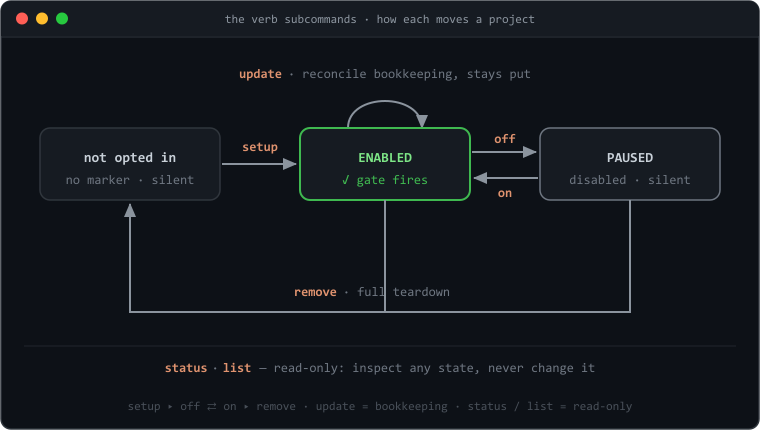

<p align="center">
  
</p>

# never-stale

<p align="center"><strong>Set the rules once — they stay in front of Claude all session.</strong><br>
<em>Keep <code>CLAUDE.md</code> in front of Claude.</em></p>

> Your Claude Code assistant keeps drifting — it forgets to update the docs, forgets
> which language you wanted, and after an **auto-compact** it loses the rules you set
> at the top of the session. **never-stale** keeps those rules in front of it the
> whole way through.

[](https://github.com/biznuts/never-stale/releases)
[](LICENSE)
[](#requirements)
[](https://docs.claude.com/en/docs/claude-code)
[](https://github.com/biznuts/never-stale/actions/workflows/ci.yml)

<p align="center">
  
</p>

## Get started in 3 steps

```text
1  /plugin marketplace add biznuts/never-stale   # add the marketplace
2  /plugin install never-stale@biznuts           # install the plugin
3  /never-stale:setup                            # pick your language — that's it
```

No restart needed — the marker arms the hooks for the next session. **Changed your
mind?** `/never-stale:remove` cleanly removes it from a project (reversible, and it
asks first); `/plugin uninstall never-stale@biznuts` removes the plugin everywhere in
one step.

## Why you want this

In a long Claude Code session the assistant quietly drifts:

- it stops updating `README` / docs after it changes the code,
- it slips back to English when you asked for another language,
- and after an **auto-compact** — when the conversation is summarized to free up
  context — it forgets the rules you set at the very top.

You *can* put those rules in `CLAUDE.md`, and Claude Code reloads that file each
session. But reloading a file is passive: nothing **reminds** the assistant to act on
it at the two moments that matter — right after a compaction, and right after it
edits a file. never-stale adds exactly those two nudges, and only in the projects you
opt in.

## Use cases

Anything you'd write in `CLAUDE.md` and want honored the **whole** session — not just
until the next auto-compact — is a fit. Rules people keep with it:

- **Language** — reply in 繁體中文 / 日本語 / your language; keep code and docs in English.
- **Doc-sync** — after changing code, update the `README`, `CHANGELOG`, or design docs.
- **Writing style** — your project's voice: terse, no emoji, no marketing fluff.
- **Coding conventions** — naming, formatting, "no new dependencies", a required pattern.
- **Process rules** — always add a test, update the migration, follow the agreed plan.
- **Guardrails** — don't edit generated files; use the repo's logger, not `console`.

The assistant honors these at the start of a session, then drifts — especially after a
compaction. never-stale re-injects them at the two moments that matter. Three worked
examples:

### Stay in your language across compactions

<p align="center"></p>

A solo dev whose replies should be in Traditional Chinese (Hong Kong) but whose code
and docs stay in English. After an auto-compact the assistant would quietly slip back
to English — never-stale re-confirms the rule the moment it happens, so it doesn't.
Opt in with a **local marker** (just this machine).

### Enforce doc-sync for the whole team

<p align="center"></p>

A team whose standard is "change the code, update the docs." Commit the marker once and
every teammate with the plugin gets the doc-sync nudge after each edit — the opt-in
travels with the repo, so there is **no per-developer setup**. Opt in with a
**committed (team) marker**.

### One root marker, per-subtree overrides (monorepo)

<p align="center"></p>

A monorepo whose root defaults to English docs, but whose `jp-app` package serves the
Japan market and needs Japanese. A marker at the root covers everything; the gate walks
**up** to the nearest one, so launching from any subdirectory resolves the right rules.
`jp-app` drops its own marker (`日本語`) to override — nearest-ancestor-wins, bounded by
the git repo root.

## Quickstart

You install the plugin in [3 steps](#get-started-in-3-steps) above, and installing it
changes nothing observable on its own. The action happens **per project** — in any
repo you want kept in sync, run:

```text
/never-stale:setup
```

It asks your languages, shows a plan of exactly what it will write, and waits for
your OK. Because the hooks ship inside the plugin, you usually **don't need to
restart** — the marker arms them for the next session immediately.

Want to look before you leap? `/never-stale:setup --dry-run` prints the plan and
writes nothing.

never-stale is driven by **verb subcommands** (plugin commands are namespaced, so you
type `/never-stale:<verb>`):

| Command | What it does |
|---|---|
| `/never-stale:setup` | Opt this project in (scaffold `CLAUDE.md` + write the marker). `--dry-run` previews. |
| `/never-stale:off` · `/never-stale:on` | **Pause** · **resume** — flip the marker's `enabled`, keeping the marker, languages, and `CLAUDE.md` block. |
| `/never-stale:status` | Read-only: what governs this project, version drift, and whether the gate would fire. |
| `/never-stale:list` | List every opted-in / legacy project on disk. |
| `/never-stale:update` | Reconcile opted-in projects to the installed version (marker version, language codes, fence tag) after a plugin upgrade. Cosmetic; `--dry-run` previews. |
| `/never-stale:remove` | Full teardown — delete the marker and strip the `CLAUDE.md` block. `--dry-run` previews. |

## How it works (30 seconds)

<p align="center">
  
</p>

> The image above is a hand-drawn illustration. To record a real GIF, see
> [`docs/recording-a-demo.md`](docs/recording-a-demo.md).



The plugin ships two hooks **inside itself** — a `SessionStart`/`compact` reminder
and a `PostToolUse`/`Edit|Write|MultiEdit` doc-sync nudge. Once installed they are
registered machine-wide, so the gate script **runs** in every session — but it only
**acts** where you dropped an opt-in **marker**. No marker → it exits silently, so
projects you never opted into are untouched. Running is not acting.

Running `/never-stale:setup` writes just two project-owned things, and **no** hook or
script into your project:

1. **A `CLAUDE.md` rules block** (wrapped in `<!-- never-stale:begin … end -->`
   sentinels): the language for spoken replies, the default language for written
   files, and "after any code change, sync the related docs."
2. **An opt-in marker** — `.claude/never-stale.json` (committed, team-shared) or
   `.claude/never-stale.local.json` (gitignored, just this machine). Its presence,
   with `"enabled": true`, is what tells the plugin's hooks to act here.

<details>
<summary><b>The full mechanism</b> (marker resolution, sentinels, fail-safe)</summary>

<br/>

**Finding the marker — an upward walk.** `${CLAUDE_PROJECT_DIR}` (and the stdin
`cwd`) is the directory Claude Code was *launched* from, which is often a
subdirectory of the project. So the gate walks **up** from there to the nearest
ancestor carrying a marker (nearest-ancestor-wins, like `.editorconfig` /
`.gitignore`), bounded by the **git repo root** so a marker outside the repo can
never govern it. Consequences:

- launching from a subdirectory still works;
- a marker at a monorepo root covers everything below it;
- a subtree can opt **out** with its own `"enabled": false` marker;
- a true sibling subtree (never an ancestor of where you are) is never touched.

**Sentinel-fenced `CLAUDE.md`.** The rules block is wrapped in
`<!-- never-stale:begin v=… hash=… -->` / `<!-- never-stale:end -->`. Teardown keys
off that fence pair, so removal is reliable **even after you edit the text inside**.
The hash is informational only (it powers a "you edited this" notice).

**Fail-safe by construction.** The gate never throws, never exits non-zero, never
writes to stderr. On any doubt it exits silently with no output. "Failing safe" means
"no reminder" — never "fire in a project you didn't opt into". A corrupt or
half-written marker is treated as disabled.

| Piece | Mechanism | Why it survives compaction |
|-------|-----------|----------------------------|
| Rules | `CLAUDE.md` (sentinel-fenced) | Loaded into context every session, re-injected after compaction |
| Compact reminder | Plugin `SessionStart` hook, matcher `compact` | Fires right after auto-compact — in opted-in projects only |
| Doc-sync reminder | Plugin `PostToolUse` hook, matcher `Edit\|Write\|MultiEdit` | Fires after each file change; path-gated to edits inside the project |
| Per-project gate | `.claude/never-stale.json` / `.local.json` marker | The machine-wide hook acts only where a marker with `enabled:true` exists |

</details>

The hooks run via **Node** (which Claude Code already requires), so the same setup
works on **Windows, macOS, and Linux** — no shell-specific scripts, no encoding
pitfalls.

## Team vs local opt-in

`/never-stale:setup` asks whether to opt the project in for the **whole team** or
**just this machine**:

- **Whole team** → `.claude/never-stale.json` is committed. Anyone with the plugin
  installed gets the reminders in this repo after they pull. (The opt-in travels with
  the repo — an intentional team decision.)
- **Just this machine** → `.claude/never-stale.local.json` is gitignored; only your
  checkout is opted in.
- A **local marker overrides a committed one**, so a teammate who doesn't want the
  reminders can run `/never-stale:off` (which drops a local marker with
  `"enabled": false`) to veto an inherited team opt-in, without changing the repo.

## Pausing or removing it from a project

<p align="center"></p>

Two levels, both per-project:

- **Pause (reversible)** — `/never-stale:off` flips the marker to `enabled:false`, so
  the gate goes silent for new sessions, but **nothing is deleted**: the marker, your
  languages, and the `CLAUDE.md` block all stay. `/never-stale:on` turns it back on
  with the same languages. On a committed team marker, `off` offers to drop a *local*
  override instead, so you can pause your own checkout without touching the repo.
- **Remove (teardown)** — `/never-stale:remove` deletes the marker (disarming the gate
  for new sessions immediately) and removes the sentinel-fenced `CLAUDE.md` block —
  **reliably, even if you edited the text inside the fence**, because removal keys off
  the sentinels, not a byte-for-byte template match. It shows a plan and asks first.

```text
/never-stale:off              # pause (reversible); /never-stale:on resumes
/never-stale:remove           # plan, confirm, then delete the per-project setup
/never-stale:remove --dry-run # just show what would be removed
/never-stale:list             # find every opted-in / legacy project on disk
```

This is per-project. The plugin itself stays installed machine-wide — remove that
with `/plugin uninstall never-stale@biznuts`, which removes **every** hook in one
step (see [Lifecycle](#lifecycle)).

## Updating

Installed plugins are pinned to the version you installed. To pull a newer release:

```text
/plugin marketplace update biznuts
/plugin install never-stale@biznuts
```

Then **restart Claude Code** (or run `/reload-plugins`) so the new command and hooks
load. To see which version you have, open `/plugin` and find never-stale in the list.

Projects you opted in earlier keep markers (and `CLAUDE.md` fences) stamped with the
version that wrote them. The gate ignores that stamp, so the drift is purely
cosmetic — but if you want it tidy, **`/never-stale:update`** sweeps your projects and
reconciles the recorded version and the language codes in one pass (it never re-asks
your languages and never changes what the gate does). Pass a parent path to sweep many
repos at once, e.g. `/never-stale:update ~/projects`.

<details>
<summary>Upgrading from 0.5.0</summary>

<br/>

0.5.0 wrote a script and two hooks into each project's `.claude/settings.json`. 0.6.0
moves the hooks into the plugin and gates them on a marker. The upgrade is safe and
gradual:

- Upgrading the plugin alone changes **nothing observable**: a not-yet-migrated 0.5.0
  project has no marker, so the new plugin gate stays silent there, while the old
  project-local hook keeps working exactly as before. **No double reminders.**
- The next time you run `/never-stale:setup` in such a project, it detects the legacy
  script + settings hooks, removes them, wraps the existing `CLAUDE.md` sections in a
  sentinel fence (keeping your text), and writes a marker. After a restart the project
  runs purely on the plugin-owned, marker-gated hook.
- Never migrate a project? Its self-contained 0.5.0 setup keeps working. Use
  `/never-stale:list` to find old installs and `/never-stale:remove` to clean them.

</details>

## Lifecycle

<p align="center"></p>

- **Install the plugin** → hooks register machine-wide but stay silent everywhere (no
  markers yet).
- **`/never-stale:setup`** in a project → writes a marker + a `CLAUDE.md` block; the
  hooks now act there.
- **`/never-stale:off`** / **`/never-stale:on`** → pause / resume in place
  (`enabled:false` / `true`); nothing is deleted.
- **`/never-stale:remove`** → deletes the marker and the fenced block; the project
  goes silent again.
- **`/plugin uninstall never-stale@biznuts`** → removes the plugin's hooks and script
  **machine-wide, atomically**. Every project instantly stops firing, with no
  per-project hook surgery.

Uninstalling leaves **zero executable code** in any project. What can remain after a
bare uninstall is inert data — the marker JSON (nothing reads it once the gate is
gone) and the sentinel-fenced rules in your `CLAUDE.md` (your own project prose). To
purge that too, run `/never-stale:remove` in each project first.

## FAQ

**Does it send my code or prompts anywhere?**
No. Everything runs locally as a Node hook. There is no network call and no telemetry.

**Does it cost extra tokens?**
Only two short reminders, and only in opted-in projects: one right after a compaction,
and one after a file edit. In projects without a marker the gate emits nothing.

**Will it fight my existing `CLAUDE.md`?**
`/never-stale:setup` inspects first. If your `CLAUDE.md` already states a language /
doc-maintenance / post-compact rule under its own structure, it flags the conflict and
makes you resolve it before writing — it never blindly appends a duplicate.

**Is uninstall really clean?**
Yes for executable code: the hooks live in the plugin, so `/plugin uninstall` removes
them everywhere at once. The only leftovers are inert data (the marker + your own
`CLAUDE.md` prose), which `/never-stale:remove` clears per project.

**Why not just rely on `CLAUDE.md`?**
`CLAUDE.md` is reloaded each session, but nothing *prompts* the assistant to act on it
at the moments it drifts. never-stale adds an active nudge right after compaction and
right after edits — the two points where "I have the rules in context" and "I actually
applied them" diverge.

## Requirements

- Claude Code with plugin support.
- Node.js on `PATH` (Claude Code already needs it).

## Troubleshooting

Reminders not firing in a project you opted into? Set `NEVER_STALE_DEBUG=1` in the
environment before launching Claude Code; the gate then appends one JSON diagnostic
line per invocation to `never-stale-debug.log` in your OS temp directory (resolved
start dir, the project root it walked up to, whether a marker was found, and the
fire/silent decision). It is off by default and never changes behavior.

## Contributing

Issues and PRs are welcome — see [CONTRIBUTING.md](CONTRIBUTING.md). The
[CHANGELOG](CHANGELOG.md) tracks every release.

## License

MIT — see [LICENSE](LICENSE).
