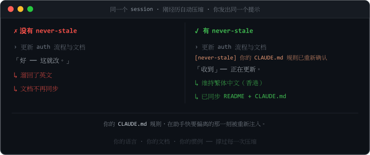
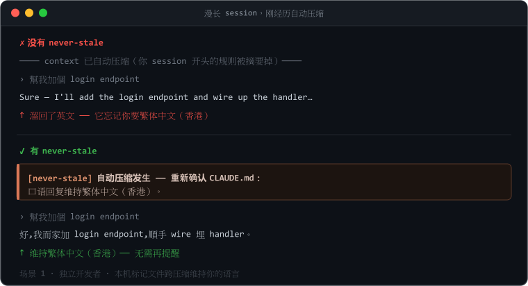
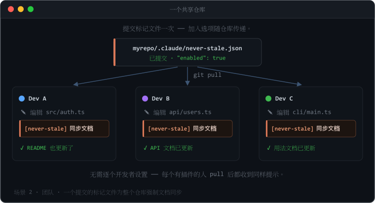
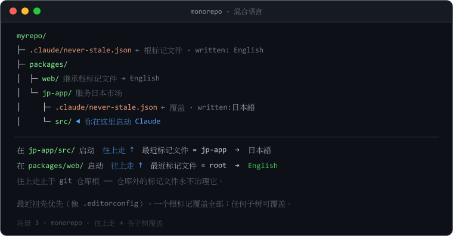
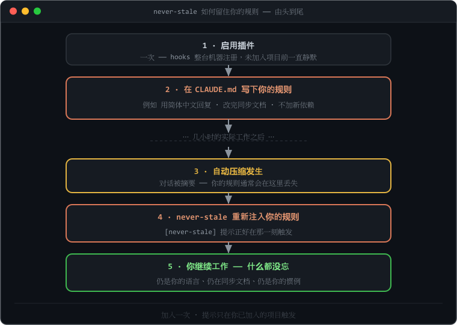
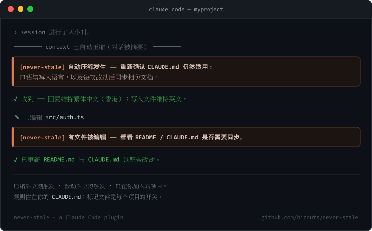
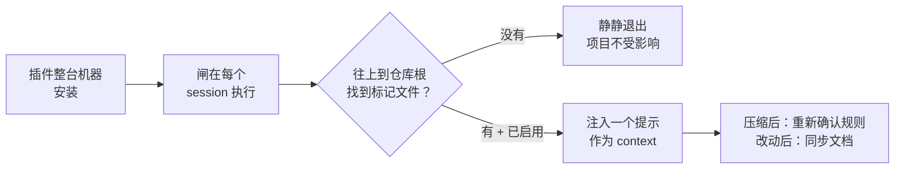
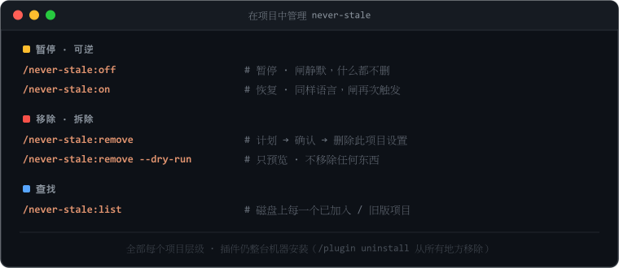
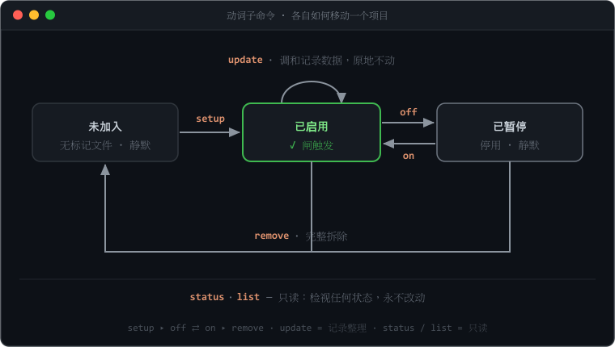

<p align="center">
  
</p>

# never-stale

<p align="center">
  <a href="README.md">English</a> ·
  <a href="README.zh-Hant.md">繁體中文</a> ·
  <strong>简体中文</strong> ·
  <a href="README.ja.md">日本語</a> ·
  <a href="README.ko.md">한국어</a>
</p>

<p align="center"><strong>规则设定一次 —— 整个 session 都留在 Claude 面前。</strong><br>
<em>让 <code>CLAUDE.md</code> 一直留在 Claude 眼前。</em></p>

> 你的 Claude Code 助手会慢慢偏离 —— 它忘记更新文档、忘记你想用哪一种语言，而且在一次
> **自动压缩（auto-compact）** 之后，它会丢失你在 session 开头定下的规则。**never-stale**
> 让这些规则全程留在它眼前。

[](https://github.com/biznuts/never-stale/releases)
[](LICENSE)
[](#系统需求)
[](https://docs.claude.com/en/docs/claude-code)
[](https://github.com/biznuts/never-stale/actions/workflows/ci.yml)

<p align="center">
  
</p>

## 三步开始使用

```text
1  /plugin marketplace add biznuts/never-stale   # 添加 marketplace
2  /plugin install never-stale@biznuts           # 安装插件
3  /never-stale:setup                            # 选择你的语言 —— 就这样
```

不需要重启 —— 标记文件（marker）会为下一个 session 武装好 hooks。**改变主意？**
`/never-stale:remove` 会干净地把它从一个项目移除（可逆，而且会先问你）；
`/plugin uninstall never-stale@biznuts` 一步把插件从所有地方移除。

## 为什么你会想要它

在一个漫长的 Claude Code session 里，助手会悄悄偏离：

- 改了代码之后就不再更新 `README` / 文档，
- 你明明要求用另一种语言，它却溜回英文，
- 而在一次 **自动压缩**（对话被摘要以腾出 context）之后，它忘记了你在最开头定下的规则。

你 *可以* 把这些规则写进 `CLAUDE.md`，而 Claude Code 每个 session 都会重新加载这个文件。
但「重新加载」是被动的：在两个最关键的时刻 —— 刚压缩之后、以及它刚改完一个文件之后 ——
没有任何东西会**提醒**助手去遵守它。never-stale 正好补上这两个提示，而且只在你选择加入的
项目里生效。

## 使用场景

任何你会写进 `CLAUDE.md`、并希望**整个** session 都被遵守（而不只是维持到下一次自动压缩）
的规则，都适合它。大家常配合它使用的规则：

- **语言** —— 用 繁體中文 / 日本語 / 你的语言回复；代码与文档保持英文。
- **文档同步** —— 改完代码后，更新 `README`、`CHANGELOG` 或设计文档。
- **写作风格** —— 你项目的语气：精简、不用 emoji、不要营销腔。
- **代码惯例** —— 命名、格式、「不加新依赖」、某个必用的模式。
- **流程规则** —— 一定要加测试、更新 migration、遵循商定好的计划。
- **护栏** —— 不要改生成出来的文件；用项目的 logger，不要用 `console`。

助手在 session 开头会遵守这些规则，然后就偏离 —— 尤其是在一次压缩之后。never-stale 会在
两个关键时刻把它们重新注入。三个实例：

### 跨压缩维持你的语言

<p align="center"></p>

一位独立开发者，回复要用繁体中文（香港），但代码与文档保持英文。一次自动压缩之后，助手
本来会悄悄溜回英文 —— never-stale 在它发生的当下重新确认规则，所以它不会。用一个
**本机标记文件（local marker）**（只在这台机器）加入。

### 为整个团队强制文档同步

<p align="center"></p>

一个团队的标准是「改代码，就更新文档」。把标记文件提交一次，每位安装了插件的队友在每次改动
之后都会收到文档同步的提示 —— 这个加入选项随仓库一起传递，所以**不需要逐个开发者设置**。
用一个 **提交进仓库的（团队）标记文件** 加入。

### 一个根标记、各子树覆盖（monorepo）

<p align="center"></p>

一个 monorepo，根目录默认文档用英文，但它的 `jp-app` 包服务日本市场、需要日语。根目录的
一个标记覆盖全部；闸会**往上**走到最近的那一个，所以从任何子目录启动都会解析到正确的规则。
`jp-app` 放下自己的标记（`日本語`）来覆盖 —— 最近祖先优先，并以 git 仓库根为界。

## 快速上手

你按上面的 [三步](#三步开始使用) 安装插件，而单单安装它本身不会造成任何可观察的改变。动作
发生在**每个项目层级** —— 在任何你想保持同步的仓库里，执行：

```text
/never-stale:setup
```

它会询问你的语言、显示一份「它将会写入什么」的计划，然后等你 OK。因为 hooks 随插件一起发布，
你通常**不需要重启** —— 标记文件会立刻为下一个 session 武装好它们。

想先看清楚再动手？`/never-stale:setup --dry-run` 会打印计划但什么都不写。

never-stale 由 **动词子命令** 驱动（插件命令有命名空间，所以你输入 `/never-stale:<动词>`）：

| 命令 | 作用 |
|---|---|
| `/never-stale:setup` | 把这个项目加入（搭建 `CLAUDE.md` 脚手架 + 写入标记文件）。`--dry-run` 预览。 |
| `/never-stale:off` · `/never-stale:on` | **暂停** · **恢复** —— 翻转标记文件的 `enabled`，同时保留标记文件、语言与 `CLAUDE.md` 区块。 |
| `/never-stale:status` | 只读：什么在治理这个项目、版本是否漂移，以及闸会不会触发。 |
| `/never-stale:list` | 列出磁盘上每一个已加入 / 旧版残留的项目。 |
| `/never-stale:update` | 在插件升级后，把已加入的项目调和到已安装的版本（标记文件版本、语言代码、围栏标签）。纯整理性质；`--dry-run` 预览。 |
| `/never-stale:remove` | 完整拆除 —— 删除标记文件并移除 `CLAUDE.md` 区块。`--dry-run` 预览。 |

## 运作原理（30 秒）

<p align="center">
  
</p>

插件在**自己内部**发布两个 hook —— 一个 `SessionStart`/`compact` 提示，以及一个
`PostToolUse`/`Edit|Write|MultiEdit` 文档同步提示。一旦安装，它们就在整台机器注册，所以闸
脚本在每个 session 都会**执行** —— 但它只在你放下加入用**标记文件**的地方**动作**。没有标记文件
→ 它静静退出，所以你从未加入的项目不受影响。执行不等于动作。

执行 `/never-stale:setup` 只写入两样项目自有的东西，而且**不会**把任何 hook 或脚本写进你的
项目：

1. **一个 `CLAUDE.md` 规则区块**（用 `<!-- never-stale:begin … end -->` 哨兵包起）：口语回复
   用的语言、写入文件的默认语言，以及「任何代码改动之后，同步相关文档」。
2. **一个加入用标记文件** —— `.claude/never-stale.json`（提交、团队共享）或
   `.claude/never-stale.local.json`（gitignore、只此机器）。它的存在加上 `"enabled": true`，
   就是告诉插件 hooks「在这里动作」的信号。

<p align="center">
  
</p>

> 一幅提示触发的手绘示意图。要录制真正的 GIF，见
> [`docs/recording-a-demo.md`](docs/recording-a-demo.md)。

<details>
<summary><b>完整机制</b>（标记文件解析、哨兵、故障安全）</summary>

<br/>



**找标记文件 —— 往上走。** `${CLAUDE_PROJECT_DIR}`（以及 stdin 的 `cwd`）是 Claude Code 被
*启动* 的目录，那通常是项目的某个子目录。所以闸会从那里**往上**走到最近一个带标记文件的祖先
（最近祖先优先，就像 `.editorconfig` / `.gitignore`），并以 **git 仓库根** 为界，使仓库
以外的标记文件永远不能治理它。结果：

- 从子目录启动依然有效；
- monorepo 根目录的一个标记文件覆盖它底下的所有东西；
- 一个子树可以用自己的 `"enabled": false` 标记文件选择**退出**；
- 一个真正的兄弟子树（永远不是你所在位置的祖先）永远不会被碰到。

**哨兵围栏的 `CLAUDE.md`。** 规则区块用
`<!-- never-stale:begin v=… hash=… -->` / `<!-- never-stale:end -->` 包起。拆除靠这对哨兵
辨认，所以**即使你改了里面的文字**，移除依然可靠。哈希只是信息性质（它驱动一个「你改过这个」
的提示）。

**从设计上故障安全。** 闸永不抛出异常、永不以非零退出、永不写 stderr。一有疑问它就静静退出、
不输出任何东西。「故障安全」意味着「没有提示」—— 而永远不是「在一个你没加入的项目里触发」。
损坏或写到一半的标记文件被当作停用。

| 组件 | 机制 | 为何能撑过压缩 |
|-------|-----------|----------------------------|
| 规则 | `CLAUDE.md`（哨兵围栏） | 每个 session 加载 context，压缩后重新注入 |
| 压缩提示 | 插件 `SessionStart` hook，matcher 为 `compact` | 自动压缩后立刻触发 —— 只在已加入的项目 |
| 文档同步提示 | 插件 `PostToolUse` hook，matcher 为 `Edit\|Write\|MultiEdit` | 每次文件改动后触发；以路径限制在项目内的改动 |
| 每个项目的闸 | `.claude/never-stale.json` / `.local.json` 标记文件 | 整台机器的 hook 只在有 `enabled:true` 标记文件的地方动作 |

</details>

这些 hook 通过 **Node**（Claude Code 本来就需要）执行，所以同一套设置可以在 **Windows、
macOS、Linux** 上运作 —— 没有 shell 专属脚本，没有编码陷阱。

## 团队 vs 本机加入

`/never-stale:setup` 会问你要为**整个团队**还是**只此机器**把项目加入：

- **整个团队** → `.claude/never-stale.json` 被提交。任何安装了插件的人在 pull 之后，都会在
  这个仓库收到提示。（加入选项随仓库传递 —— 这是一个刻意的团队决定。）
- **只此机器** → `.claude/never-stale.local.json` 被 gitignore；只有你的 checkout 被加入。
- **本机标记文件会覆盖提交进仓库的那个**，所以一位不想要提示的队友可以执行
  `/never-stale:off`（它会放下一个 `"enabled": false` 的本机标记文件）来否决一个继承来的团队
  加入，而不必改动仓库。

## 从项目暂停或移除它

<p align="center"></p>

两个层级，都是每个项目：

- **暂停（可逆）** —— `/never-stale:off` 把标记文件翻成 `enabled:false`，于是闸对新的 session
  静默，但**什么都不会被删**：标记文件、你的语言、`CLAUDE.md` 区块全部留着。`/never-stale:on`
  用同样的语言把它重新打开。在一个提交进仓库的团队标记文件上，`off` 会提议改放一个 *本机*
  覆盖，让你能在不碰仓库的情况下暂停自己的 checkout。
- **移除（拆除）** —— `/never-stale:remove` 删除标记文件（立刻为新的 session 解除闸的武装）并
  移除哨兵围栏的 `CLAUDE.md` 区块 —— **即使你改过围栏里的文字也可靠**，因为移除靠哨兵辨认，
  不是逐字比对模板。它会显示计划并先问你。

```text
/never-stale:off              # 暂停（可逆）；/never-stale:on 恢复
/never-stale:remove           # 计划、确认，然后删除此项目的设置
/never-stale:remove --dry-run # 只显示会移除什么
/never-stale:list             # 找出磁盘上每一个已加入 / 旧版残留的项目
```

这是每个项目层级的。插件本身仍然整台机器安装着 —— 用
`/plugin uninstall never-stale@biznuts` 移除它，一步移除**每一个** hook（见
[生命周期](#生命周期)）。

## 更新

已安装的插件被钉在你安装时的版本。要拉取较新的版本：

```text
/plugin marketplace update biznuts
/plugin install never-stale@biznuts
```

然后**重启 Claude Code**（或执行 `/reload-plugins`）让新的命令与 hooks 加载。要看你装的是
哪个版本，打开 `/plugin` 在列表中找 never-stale。

你较早加入的项目，会保留标记文件（以及 `CLAUDE.md` 围栏），上面盖着写入它们时的版本。闸会忽略
这个版本印记，所以这种漂移纯属表面 —— 但若你想整齐一点，**`/never-stale:update`** 会扫过你的
项目，一次性调和记录的版本与语言代码（它永远不会重问你的语言，也永远不会改变闸的行为）。传一个
上层路径进去就能一次扫多个仓库，例如 `/never-stale:update ~/projects`。

<details>
<summary>从 0.5.0 升级</summary>

<br/>

0.5.0 会把一个脚本与两个 hook 写进每个项目的 `.claude/settings.json`。0.6.0 把 hooks 移进插件
并以标记文件来把关。这个升级安全而且渐进：

- 单单升级插件**不会造成任何可观察的改变**：一个尚未迁移的 0.5.0 项目没有标记文件，所以新的插件
  闸在那里保持静默，而旧的项目本地 hook 照常运作。**没有重复提示。**
- 下次你在这样的项目里执行 `/never-stale:setup`，它会检测到旧版脚本 + settings hooks、把它们
  移除、把现有的 `CLAUDE.md` 各节用哨兵围栏包起（保留你的文字），并写入一个标记文件。重启之后，
  项目就纯粹靠插件自有、由标记文件把关的 hook 运作。
- 永不迁移某个项目？它自足的 0.5.0 设置照常运作。用 `/never-stale:list` 找出旧安装、用
  `/never-stale:remove` 清理它们。

</details>

## 生命周期

<p align="center"></p>

- **安装插件** → hooks 整台机器注册，但到处都静默（还没有标记文件）。
- **在项目执行 `/never-stale:setup`** → 写入一个标记文件 + 一个 `CLAUDE.md` 区块；hooks 现在在
  那里动作。
- **`/never-stale:off`** / **`/never-stale:on`** → 原地暂停 / 恢复（`enabled:false` / `true`）；
  什么都不会被删。
- **`/never-stale:remove`** → 删除标记文件与围栏区块；项目重新静默。
- **`/plugin uninstall never-stale@biznuts`** → 把插件的 hooks 与脚本**整台机器、原子性地**
  移除。每个项目立刻停止触发，不需要逐个项目做 hook 手术。

卸载会在任何项目里留下**零可执行代码**。一次裸卸载之后可能残留的，是惰性数据 ——
标记文件 JSON（闸一旦消失就没有东西读它）以及你 `CLAUDE.md` 里哨兵围栏的规则（你自己的项目文字）。
要连这些都清掉，先在每个项目执行 `/never-stale:remove`。

## 常见问题

**它会把我的代码或提示发送到任何地方吗？**
不会。一切都作为一个 Node hook 在本机执行。没有网络调用、没有遥测。

**它会花额外的 token 吗？**
只有两段短提示，而且只在已加入的项目：一段在压缩后紧接着、一段在文件改动后。在没有标记文件的
项目里，闸什么都不输出。

**它会跟我现有的 `CLAUDE.md` 打架吗？**
`/never-stale:setup` 会先检查。若你的 `CLAUDE.md` 已经用自己的结构写了语言 / 文档维护 / 压缩
后的规则，它会标示冲突并要你先解决才写入 —— 它永远不会盲目追加一份重复的。

**卸载真的干净吗？**
对可执行代码而言是的：hooks 住在插件里，所以 `/plugin uninstall` 一次把它们从所有地方移除。
唯一的残留是惰性数据（标记文件 + 你自己的 `CLAUDE.md` 文字），这些可以用 `/never-stale:remove`
逐个项目清掉。

**为什么不干脆靠 `CLAUDE.md`？**
`CLAUDE.md` 每个 session 都会重新加载，但没有东西在它偏离的时刻*促使*助手去遵守它。never-stale
在压缩后紧接着、以及改动后紧接着加上一个主动的提示 —— 正是「我 context 里有规则」与「我真的
应用了它们」分歧的那两个点。

## 系统需求

- 支持插件的 Claude Code。
- `PATH` 上有 Node.js（Claude Code 本来就需要）。

## 疑难排解

在你已加入的项目里提示没有触发？在启动 Claude Code 前在环境设置 `NEVER_STALE_DEBUG=1`；闸之后
会在你 OS 临时目录的 `never-stale-debug.log` 里，每次调用附上一行 JSON 诊断（解析出的起始目录、
它往上走到的项目根、是否找到标记文件，以及触发 / 静默的决定）。它默认关闭，永远不会改变行为。

## 贡献

欢迎 issue 与 PR —— 见 [CONTRIBUTING.md](CONTRIBUTING.md)。[CHANGELOG](CHANGELOG.md) 记录每一个
版本。翻译以英文 `README.md` 为准；其他语言版本可能略为滞后。发现翻译不准确？欢迎开一个翻译 PR。

## 许可证

MIT —— 见 [LICENSE](LICENSE)。
