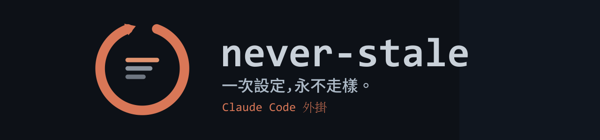
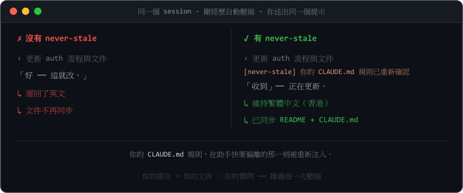
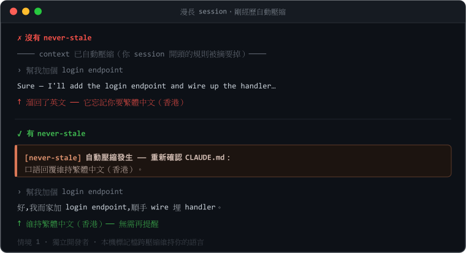
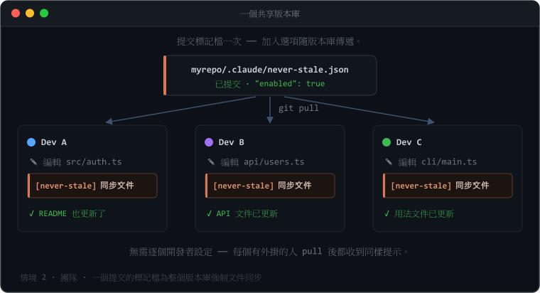
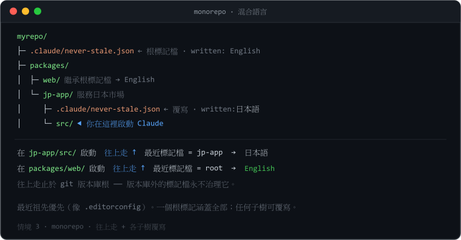
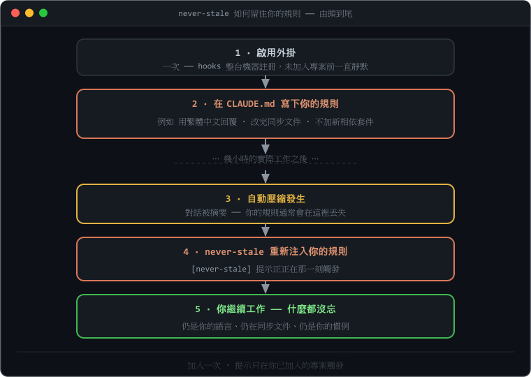
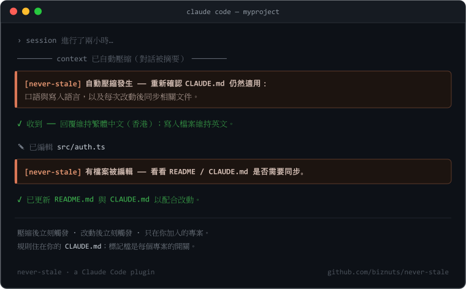
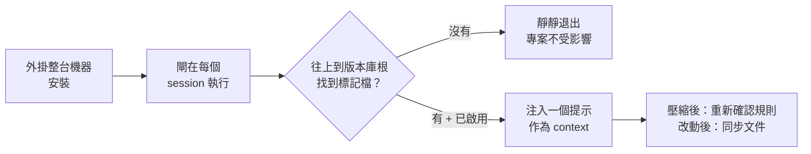
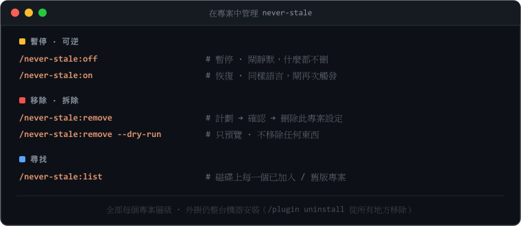
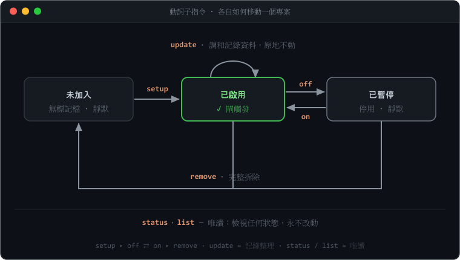

<p align="center">
  
</p>

# never-stale

<p align="center">
  <a href="README.md">English</a> ·
  <strong>繁體中文</strong> ·
  <a href="README.zh-Hans.md">简体中文</a> ·
  <a href="README.ja.md">日本語</a> ·
  <a href="README.ko.md">한국어</a>
</p>

<p align="center"><strong>規則設定一次 —— 整個 session 都留在 Claude 面前。</strong><br>
<em>讓 <code>CLAUDE.md</code> 一直留在 Claude 眼前。</em></p>

> 你的 Claude Code 助手會慢慢偏離 —— 它忘記更新文件、忘記你想用哪一種語言，而且在一次
> **自動壓縮（auto-compact）** 之後，它會丟失你在 session 開頭定下的規則。**never-stale**
> 讓這些規則全程留在它眼前。

[](https://github.com/biznuts/never-stale/releases)
[](LICENSE)
[](#系統需求)
[](https://docs.claude.com/en/docs/claude-code)
[](https://github.com/biznuts/never-stale/actions/workflows/ci.yml)

<p align="center">
  
</p>

## 三步開始使用

```text
1  /plugin marketplace add biznuts/never-stale   # 加入 marketplace
2  /plugin install never-stale@biznuts           # 安裝外掛
3  /never-stale:setup                            # 選擇你的語言 —— 就這樣
```

不需要重啟 —— 標記檔（marker）會為下一個 session 武裝好 hooks。**改變主意？**
`/never-stale:remove` 會乾淨地把它從一個專案移除（可逆，而且會先問你）；
`/plugin uninstall never-stale@biznuts` 一步把外掛從所有地方移除。

## 為什麼你會想要它

在一個漫長的 Claude Code session 裡，助手會悄悄偏離：

- 改了程式碼之後就不再更新 `README` / 文件，
- 你明明要求用另一種語言，它卻溜回英文，
- 而在一次 **自動壓縮**（對話被摘要以騰出 context）之後，它忘記了你在最開頭定下的規則。

你 *可以* 把這些規則寫進 `CLAUDE.md`，而 Claude Code 每個 session 都會重新載入這個檔案。
但「重新載入」是被動的：在兩個最關鍵的時刻 —— 剛壓縮之後、以及它剛改完一個檔案之後 ——
沒有任何東西會**提醒**助手去遵守它。never-stale 正正補上這兩個提示，而且只在你選擇加入的
專案裡生效。

## 使用情境

任何你會寫進 `CLAUDE.md`、並希望**整個** session 都被遵守（而不只是維持到下一次自動壓縮）
的規則，都適合它。大家常配合它使用的規則：

- **語言** —— 用 繁體中文 / 日本語 / 你的語言回覆；程式碼與文件保持英文。
- **文件同步** —— 改完程式碼後，更新 `README`、`CHANGELOG` 或設計文件。
- **寫作風格** —— 你專案的語氣：精簡、不用 emoji、不要行銷腔。
- **程式碼慣例** —— 命名、格式、「不加新相依套件」、某個必用的模式。
- **流程規則** —— 一定要加測試、更新 migration、遵循商定好的計劃。
- **防護欄** —— 不要改產生出來的檔案；用專案的 logger，不要用 `console`。

助手在 session 開頭會遵守這些規則，然後就偏離 —— 尤其是在一次壓縮之後。never-stale 會在
兩個關鍵時刻把它們重新注入。三個實例：

### 跨壓縮維持你的語言

<p align="center"></p>

一位獨立開發者，回覆要用繁體中文（香港），但程式碼與文件保持英文。一次自動壓縮之後，助手
本來會悄悄溜回英文 —— never-stale 在它發生的當下重新確認規則，所以它不會。用一個
**本機標記檔（local marker）**（只在這台機器）加入。

### 為整個團隊強制文件同步

<p align="center"></p>

一個團隊的標準是「改程式碼，就更新文件」。把標記檔提交一次，每位安裝了外掛的隊友在每次改動
之後都會收到文件同步的提示 —— 這個加入選項隨版本庫一起傳遞，所以**不需要逐個開發者設定**。
用一個 **提交進版本庫的（團隊）標記檔** 加入。

### 一個根標記、各子樹覆寫（monorepo）

<p align="center"></p>

一個 monorepo，根目錄預設文件用英文，但它的 `jp-app` 套件服務日本市場、需要日語。根目錄的
一個標記涵蓋全部；閘會**往上**走到最近的那一個，所以從任何子目錄啟動都會解析到正確的規則。
`jp-app` 放下自己的標記（`日本語`）來覆寫 —— 最近祖先優先，並以 git 版本庫根為界。

## 快速上手

你按上面的 [三步](#三步開始使用) 安裝外掛，而單單安裝它本身不會造成任何可觀察的改變。動作
發生在**每個專案層級** —— 在任何你想保持同步的版本庫裡，執行：

```text
/never-stale:setup
```

它會詢問你的語言、顯示一份「它將會寫入什麼」的計劃，然後等你 OK。因為 hooks 隨外掛一起出貨，
你通常**不需要重啟** —— 標記檔會立刻為下一個 session 武裝好它們。

想先看清楚再動手？`/never-stale:setup --dry-run` 會印出計劃但什麼都不寫。

never-stale 由 **動詞子指令** 驅動（外掛指令有命名空間，所以你輸入 `/never-stale:<動詞>`）：

| 指令 | 作用 |
|---|---|
| `/never-stale:setup` | 把這個專案加入（建立 `CLAUDE.md` 鷹架 + 寫入標記檔）。`--dry-run` 預覽。 |
| `/never-stale:off` · `/never-stale:on` | **暫停** · **恢復** —— 翻轉標記檔的 `enabled`，同時保留標記檔、語言與 `CLAUDE.md` 區塊。 |
| `/never-stale:status` | 唯讀：什麼在治理這個專案、版本是否漂移，以及閘會不會觸發。 |
| `/never-stale:list` | 列出磁碟上每一個已加入 / 舊版殘留的專案。 |
| `/never-stale:update` | 在外掛升級後，把已加入的專案調和到已安裝的版本（標記檔版本、語言碼、圍欄標籤）。純整理性質；`--dry-run` 預覽。 |
| `/never-stale:remove` | 完整拆除 —— 刪除標記檔並移除 `CLAUDE.md` 區塊。`--dry-run` 預覽。 |

## 運作原理（30 秒）

<p align="center">
  
</p>

外掛在**自己內部**出貨兩個 hook —— 一個 `SessionStart`/`compact` 提示，以及一個
`PostToolUse`/`Edit|Write|MultiEdit` 文件同步提示。一旦安裝，它們就在整台機器註冊，所以閘
腳本在每個 session 都會**執行** —— 但它只在你放下加入用**標記檔**的地方**動作**。沒有標記檔
→ 它靜靜退出，所以你從未加入的專案不受影響。執行不等於動作。

執行 `/never-stale:setup` 只寫入兩樣專案自有的東西，而且**不會**把任何 hook 或腳本寫進你的
專案：

1. **一個 `CLAUDE.md` 規則區塊**（用 `<!-- never-stale:begin … end -->` 哨兵包起）：口語回覆
   用的語言、寫入檔案的預設語言，以及「任何程式碼改動之後，同步相關文件」。
2. **一個加入用標記檔** —— `.claude/never-stale.json`（提交、團隊共享）或
   `.claude/never-stale.local.json`（gitignore、只此機器）。它的存在加上 `"enabled": true`，
   就是告訴外掛 hooks「在這裡動作」的信號。

<p align="center">
  
</p>

> 一幅提示觸發的手繪示意圖。要錄製真正的 GIF，見
> [`docs/recording-a-demo.md`](docs/recording-a-demo.md)。

<details>
<summary><b>完整機制</b>（標記檔解析、哨兵、故障安全）</summary>

<br/>



**找標記檔 —— 往上走。** `${CLAUDE_PROJECT_DIR}`（以及 stdin 的 `cwd`）是 Claude Code 被
*啟動* 的目錄，那通常是專案的某個子目錄。所以閘會從那裡**往上**走到最近一個帶標記檔的祖先
（最近祖先優先，就像 `.editorconfig` / `.gitignore`），並以 **git 版本庫根** 為界，使版本庫
以外的標記檔永遠不能治理它。結果：

- 從子目錄啟動依然有效；
- monorepo 根目錄的一個標記檔涵蓋它底下的所有東西；
- 一個子樹可以用自己的 `"enabled": false` 標記檔選擇**退出**；
- 一個真正的兄弟子樹（永遠不是你所在位置的祖先）永遠不會被碰到。

**哨兵圍欄的 `CLAUDE.md`。** 規則區塊用
`<!-- never-stale:begin v=… hash=… -->` / `<!-- never-stale:end -->` 包起。拆除靠這對哨兵
辨認，所以**即使你改了裡面的文字**，移除依然可靠。雜湊只是資訊性質（它驅動一個「你改過這個」
的提示）。

**從設計上故障安全。** 閘永不丟出例外、永不以非零退出、永不寫 stderr。一有疑問它就靜靜退出、
不輸出任何東西。「故障安全」意味著「沒有提示」—— 而永遠不是「在一個你沒加入的專案裡觸發」。
損毀或寫到一半的標記檔被當作停用。

| 元件 | 機制 | 為何能撐過壓縮 |
|-------|-----------|----------------------------|
| 規則 | `CLAUDE.md`（哨兵圍欄） | 每個 session 載入 context，壓縮後重新注入 |
| 壓縮提示 | 外掛 `SessionStart` hook，matcher 為 `compact` | 自動壓縮後立刻觸發 —— 只在已加入的專案 |
| 文件同步提示 | 外掛 `PostToolUse` hook，matcher 為 `Edit\|Write\|MultiEdit` | 每次檔案改動後觸發；以路徑限制在專案內的改動 |
| 每個專案的閘 | `.claude/never-stale.json` / `.local.json` 標記檔 | 整台機器的 hook 只在有 `enabled:true` 標記檔的地方動作 |

</details>

這些 hook 透過 **Node**（Claude Code 本來就需要）執行，所以同一套設定可以在 **Windows、
macOS、Linux** 上運作 —— 沒有 shell 專屬腳本，沒有編碼陷阱。

## 團隊 vs 本機加入

`/never-stale:setup` 會問你要為**整個團隊**還是**只此機器**把專案加入：

- **整個團隊** → `.claude/never-stale.json` 被提交。任何安裝了外掛的人在 pull 之後，都會在
  這個版本庫收到提示。（加入選項隨版本庫傳遞 —— 這是一個刻意的團隊決定。）
- **只此機器** → `.claude/never-stale.local.json` 被 gitignore；只有你的 checkout 被加入。
- **本機標記檔會覆寫提交進版本庫的那個**，所以一位不想要提示的隊友可以執行
  `/never-stale:off`（它會放下一個 `"enabled": false` 的本機標記檔）來否決一個繼承來的團隊
  加入，而不必改動版本庫。

## 從專案暫停或移除它

<p align="center"></p>

兩個層級，都是每個專案：

- **暫停（可逆）** —— `/never-stale:off` 把標記檔翻成 `enabled:false`，於是閘對新的 session
  靜默，但**什麼都不會被刪**：標記檔、你的語言、`CLAUDE.md` 區塊全部留著。`/never-stale:on`
  用同樣的語言把它重新打開。在一個提交進版本庫的團隊標記檔上，`off` 會提議改放一個 *本機*
  覆寫，讓你能在不碰版本庫的情況下暫停自己的 checkout。
- **移除（拆除）** —— `/never-stale:remove` 刪除標記檔（立刻為新的 session 解除閘的武裝）並
  移除哨兵圍欄的 `CLAUDE.md` 區塊 —— **即使你改過圍欄裡的文字也可靠**，因為移除靠哨兵辨認，
  不是逐字比對範本。它會顯示計劃並先問你。

```text
/never-stale:off              # 暫停（可逆）；/never-stale:on 恢復
/never-stale:remove           # 計劃、確認，然後刪除此專案的設定
/never-stale:remove --dry-run # 只顯示會移除什麼
/never-stale:list             # 找出磁碟上每一個已加入 / 舊版殘留的專案
```

這是每個專案層級的。外掛本身仍然整台機器安裝著 —— 用
`/plugin uninstall never-stale@biznuts` 移除它，一步移除**每一個** hook（見
[生命週期](#生命週期)）。

## 更新

已安裝的外掛被釘在你安裝時的版本。要拉取較新的版本：

```text
/plugin marketplace update biznuts
/plugin install never-stale@biznuts
```

然後**重啟 Claude Code**（或執行 `/reload-plugins`）讓新的指令與 hooks 載入。要看你裝的是
哪個版本，打開 `/plugin` 在清單中找 never-stale。

你較早加入的專案，會保留標記檔（以及 `CLAUDE.md` 圍欄），上面蓋著寫入它們時的版本。閘會忽略
這個版本印記，所以這種漂移純屬外觀 —— 但若你想整齊一點，**`/never-stale:update`** 會掃過你的
專案，一次過調和記錄的版本與語言碼（它永遠不會重問你的語言，也永遠不會改變閘的行為）。傳一個
上層路徑進去就能一次掃多個版本庫，例如 `/never-stale:update ~/projects`。

<details>
<summary>從 0.5.0 升級</summary>

<br/>

0.5.0 會把一個腳本與兩個 hook 寫進每個專案的 `.claude/settings.json`。0.6.0 把 hooks 移進外掛
並以標記檔來把關。這個升級安全而且漸進：

- 單單升級外掛**不會造成任何可觀察的改變**：一個尚未遷移的 0.5.0 專案沒有標記檔，所以新的外掛
  閘在那裡保持靜默，而舊的專案本地 hook 照常運作。**沒有重複提示。**
- 下次你在這樣的專案裡執行 `/never-stale:setup`，它會偵測到舊版腳本 + settings hooks、把它們
  移除、把現有的 `CLAUDE.md` 各節用哨兵圍欄包起（保留你的文字），並寫入一個標記檔。重啟之後，
  專案就純粹靠外掛自有、由標記檔把關的 hook 運作。
- 永不遷移某個專案？它自足的 0.5.0 設定照常運作。用 `/never-stale:list` 找出舊安裝、用
  `/never-stale:remove` 清理它們。

</details>

## 生命週期

<p align="center"></p>

- **安裝外掛** → hooks 整台機器註冊，但到處都靜默（還沒有標記檔）。
- **在專案執行 `/never-stale:setup`** → 寫入一個標記檔 + 一個 `CLAUDE.md` 區塊；hooks 現在在
  那裡動作。
- **`/never-stale:off`** / **`/never-stale:on`** → 原地暫停 / 恢復（`enabled:false` / `true`）；
  什麼都不會被刪。
- **`/never-stale:remove`** → 刪除標記檔與圍欄區塊；專案重新靜默。
- **`/plugin uninstall never-stale@biznuts`** → 把外掛的 hooks 與腳本**整台機器、原子性地**
  移除。每個專案立刻停止觸發，不需要逐個專案做 hook 手術。

解除安裝會在任何專案裡留下**零可執行程式碼**。一次裸解除安裝之後可能殘留的，是惰性資料 ——
標記檔 JSON（閘一旦消失就沒有東西讀它）以及你 `CLAUDE.md` 裡哨兵圍欄的規則（你自己的專案文字）。
要連這些都清掉，先在每個專案執行 `/never-stale:remove`。

## 常見問題

**它會把我的程式碼或提示送去任何地方嗎？**
不會。一切都作為一個 Node hook 在本機執行。沒有網路呼叫、沒有遙測。

**它會花額外的 token 嗎？**
只有兩段短提示，而且只在已加入的專案：一段在壓縮後緊接著、一段在檔案改動後。在沒有標記檔的
專案裡，閘什麼都不輸出。

**它會跟我現有的 `CLAUDE.md` 打架嗎？**
`/never-stale:setup` 會先檢查。若你的 `CLAUDE.md` 已經用自己的結構寫了語言 / 文件維護 / 壓縮
後的規則，它會標示衝突並要你先解決才寫入 —— 它永遠不會盲目追加一份重複的。

**解除安裝真的乾淨嗎？**
對可執行程式碼而言是的：hooks 住在外掛裡，所以 `/plugin uninstall` 一次把它們從所有地方移除。
唯一的殘留是惰性資料（標記檔 + 你自己的 `CLAUDE.md` 文字），這些可以用 `/never-stale:remove`
逐個專案清掉。

**為什麼不乾脆靠 `CLAUDE.md`？**
`CLAUDE.md` 每個 session 都會重新載入，但沒有東西在它偏離的時刻*促使*助手去遵守它。never-stale
在壓縮後緊接著、以及改動後緊接著加上一個主動的提示 —— 正是「我 context 裡有規則」與「我真的
套用了它們」分歧的那兩個點。

## 系統需求

- 支援外掛的 Claude Code。
- `PATH` 上有 Node.js（Claude Code 本來就需要）。

## 疑難排解

在你已加入的專案裡提示沒有觸發？在啟動 Claude Code 前於環境設定 `NEVER_STALE_DEBUG=1`；閘之後
會在你 OS 暫存目錄的 `never-stale-debug.log` 裡，每次呼叫附上一行 JSON 診斷（解析出的起始目錄、
它往上走到的專案根、是否找到標記檔，以及觸發 / 靜默的決定）。它預設關閉，永遠不會改變行為。

## 貢獻

歡迎 issue 與 PR —— 見 [CONTRIBUTING.md](CONTRIBUTING.md)。[CHANGELOG](CHANGELOG.md) 記錄每一個
版本。翻譯以英文 `README.md` 為準；其他語言版本可能略為滯後。發現翻譯不準確？歡迎開一個翻譯 PR。

## 授權

MIT —— 見 [LICENSE](LICENSE)。
